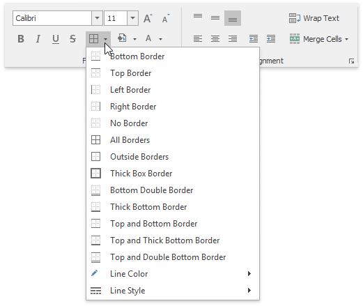
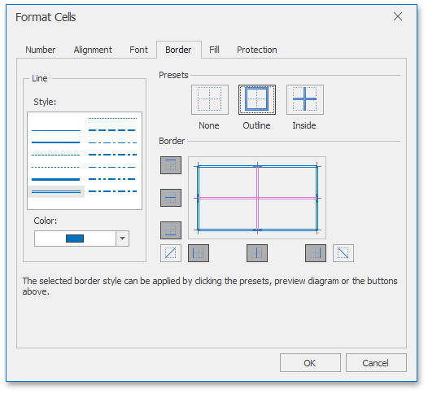
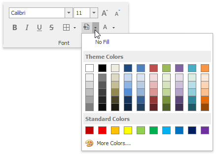
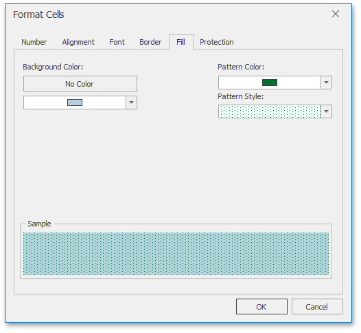

# Format Cells
The **Spreadsheet** provides the capability to format cells and the data they contain. It includes many predefined styles that you can use.

To format a cell or a range of cells, follow the instructions below.

## Using Predefined Styles
1. [Select](../editing-cells/select-cells-or-cell-content.md) the cells you wish to format.
2. In the **Styles** group within the **Home** tab, select the style that you wish to apply to the selected cells.
	
	

## Applying Specific Formatting
If you are not satisfied with the predefined styles, specify your own formatting options.
1. [Select](../editing-cells/select-cells-or-cell-content.md) the cells you wish to format.
2. To add borders to the selected cells, do one of the following.
	* In the **Font** group within the **Home** tab, click the **Borders** button's drop-down menu and select the border type. This menu also allows you to select the line style and line color of borders.
		
		
	* Click the **Font** dialog box launcher to invoke the **Format Cells** dialog box. Click the **Border** tab and specify all required parameters. Then click **OK**.
		
		
3. To set the background color of the selected cells, do one of the following.
	* In the **Font** group within the **Home** tab, click the **Fill Color** button's drop-down menu and select the desired color.
		
		
	* Click the **Font** dialog box launcher, and in the invoked **Format Cells** dialog box, open the **Fill** tab. Specify all required parameters and click **OK**.
		
		