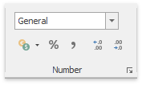

# Number Formatting
The **Spreadsheet** allows you to format numbers in cells to make them easier to read and understand. For example, you can display numbers as monetary values or dates. The default format for cell content is the _General_ style. Notice that number formatting does not change the value you enter, it only influences the way the number is displayed in a cell. Number formatting options are available in the **Number** group within the **Home** tab.

To apply the number format to a cell value, select the required format in the number format list at the top of the **Number** group, or use buttons at the bottom of the group, such as **Accounting Number Format**, **Percent Style** or **Comma Style**.

If you wish to set more formatting parameters, click the **Number** dialog box launcher to invoke the **Format Cells** dialog box. Select the desired number format, and then specify formatting options in the right pane of the dialog box.

You can use the following shortcuts to quickly apply the specified number format.

|  |  |
|---|---|
| CTRL+SHIFT+1 | Applies the Number format with two decimal places. |
| CTRL+SHIFT+2 | Applies the Time number format. |
| CTRL+SHIFT+3 | Applies the Date format. |
| CTRL+SHIFT+4 | Applies the Currency format. |
| CTRL+SHIFT+5 | Applies the Percentage format. |
| CTRL+SHIFT+6 | Applies the Scientific number format. |