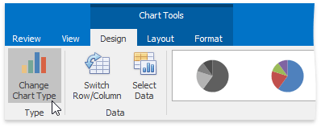
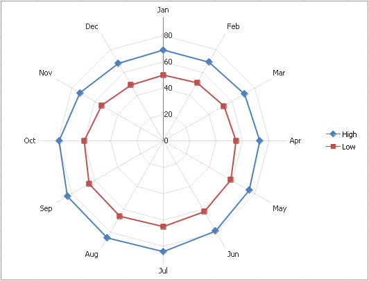

The **Spreadsheet** allows you to change the type of the existing chart. To do this, click the chart to display the **Chart Tools** contextual tab.

Click the **Change Chart Type** button in the **Type** group within the **Design** tab...

... or right-click the chart and select the **Change Chart Type...** item in the context menu.

In the invoked **Change Chart Type** dialog, select a new chart type and click **OK**.

The following image illustrates the chart with the **Radar with Markers** chart type applied.

