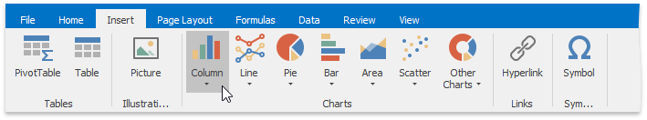
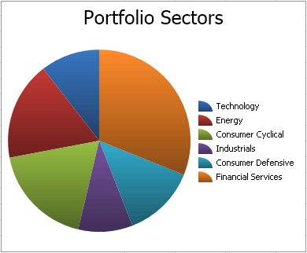
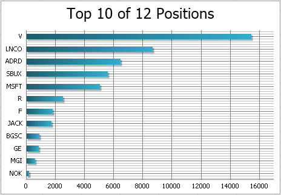
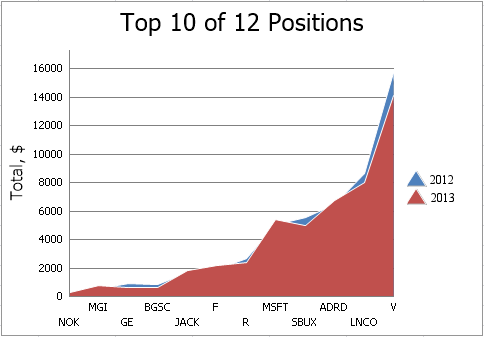
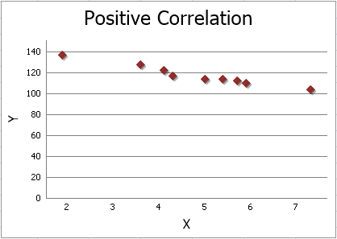
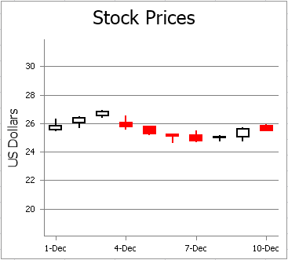

# Charting Overview
The **Spreadsheet** provides the capability to summarize worksheet data visually using a variety of **charts**. Charts display data series visually to make data interpretation easier, and show the relationship between different data series. To create a chart, click the chart type you wish to insert in the **Charts** group within the **Insert** tab.

The following chart types are currently available in the **Spreadsheet**:
* **Column Charts**
	
	Column charts are used to display series as sets of vertical bars (or columns) that are grouped by category. The bar lengths are proportional to the values that they represent. Column charts are typically used to compare values in different categories. Some column graphs display series as individual columns, grouped by category, and others show columns divided into subparts to show a cumulative effect (stacked column graphs). You can select column charts of different shapes, such as cylinder, cone or pyramid.
	
	
* **Line Charts**
	
	Line charts display information as a series of data points connected by line segments. This chart type is useful when you need to show trends for several series on the same diagram, and to compare values of several series for the same point argument.
	
	
* **Pie Charts**
	
	Pie and doughnut charts are used to compare the percentage values of different point arguments in the same series. These charts may be useful to determine which point value is the most significant, or which values in the point series are the most significant. A doughnut chart is functionally identical to a pie chart. The main difference is the shape of the doughnut chart, and that it can contain more than one data series.
	
	
* **Bar Charts**
	
	Bar charts are identical to column charts with one exception: bar charts use horizontal bars instead of vertical bars to compare values across categories. Some bar graphs display series as individual bars grouped by category, and others show bars divided into subparts to show a cumulative effect (stacked bar graphs). You can select bar charts of different shapes, such as cylinder, cone or pyramid.
	
	
* **Area Charts**
	
	Area charts display series as filled areas in a diagram, with each data point displayed as a peak or valley in the area. This chart type is useful when you need to show trends for several series on the same diagram, and also show the relationship of the parts to the whole. The area chart is based on the line chart, with the area below the plotted line filled with color.
	
	
* **Scatter Charts**
	
	Scatter charts are used to plot data points on the horizontal and vertical axis to show the relationship between two sets of data. This chart type combines data values into single data points and displays them in uneven intervals (or clusters).
	
	Bubble charts allow you to visually represent data that has a third dimension, expressed in the bubble's size. You map two dimensions along the horizontal and vertical axes, and then the third dimension is displayed as a filled circle at the data point.
	
	
* **Stock Charts**
	
	Stock charts are used to show variation in stock prices over the course of a day. In the **High-Low-Close** chart type, the **High** and **Low** prices are represented by the top and bottom values of the vertical line that is shown at each point, and the **Close** prices are represented by the right tick marks. In the **Open-High-Low-Close** chart type, the **High** and **Low** prices are shown in the same way as in the **High-Low-Close** charts, but the **Open** and **Close** prices are represented by the bottom and top borders of a rectangle. If the stock closes higher than its opening price, the rectangle is hollow. And if the stock closes lower than its opening price, the rectangle is filled.
	
	
* **Radar Charts**
	
	Radar charts are used when it is necessary to display series as an area on a circular grid that has multiple axes along which data can be plotted, so values are shown relative to a center point.
	
	