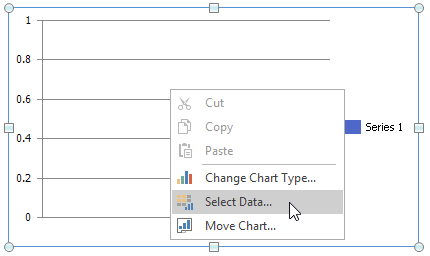

# Creating a Chart Sheet
The **Spreadsheet** allows you to create two chart types: an [embedded chart](creating-a-chart.md) inserted into an existing worksheet and a standalone chart placed on a separate sheet in a workbook - a *chart sheet*. Chart sheets are useful when you need to show or print a chart on a page without any worksheet data.

Select the action you wish to perform:

* [Insert a New Chart Sheet](#newchartsheet)
* [Move an Existing Chart to a Chart Sheet](#movetochartsheet)
* [Remove a Chart Sheet](#removechartsheet)

## Insert a New Chart Sheet
1. On the **Sheet** tab bar, right-click an existing worksheet's tab and select **Insert...** in the context menu.

	

2. Select **Chart** in the invoked dialog and click **OK**.

   

   As a result, an empty chart sheet with a default name is added to the document.

3. Select the chart data by clicking **Select Data** in the **Data** group, on the **Chart Tools** | **Design** tab...

   
   
   ... or by right-clicking an empty chart area and clicking **Select Data...** in the context menu.
   
   

4. In the invoked **Select Data Source** dialog, enter a reference to the cell range containing the chart data. You can use the **Collapse Dialog** button  to select this range directly in a worksheet.

   
   
   The **Spreadsheet** creates a clustered column chart by default.

5. To change the default chart type, click **Change Chart Type** in the **Type** group, on the **Chart Tools** | **Design** tab...

   
   
   ... or right-click a chart and select **Change Chart Type...** in the context menu.
   
   

6. In the invoked **Change Chart Type** dialog, select a new chart type and click **OK**.

   

Use other options on the **Chart Tools** contextual tab to fine-tune chart settings like applying a [chart style](applying-a-predefined-chart-layout-and-style.md) and adjusting the [chart's layout](applying-a-predefined-chart-layout-and-style.md).

## Move an Existing Chart to a Chart Sheet
To move an existing chart from a worksheet to a separate chart sheet, follow the steps below:

1. Click **Move Chart** in the **Location** group, on the **Chart Tools** | **Design** tab...

   

   ... or right-click the chart and select **Move Chart...** in the context menu.

   

2. In the invoked dialog, select **New Sheet** and then enter a chart sheet name. Click **OK** to create a chart sheet with the specified chart.

   

## Remove a Chart Sheet
To delete a chart sheet, right-click its tab on the **Sheet** tab bar, and then click **Delete** in the context menu.

If you want to preserve a chart located on a chart sheet, you can move the chart back to the worksheet containing the source data or place it on another worksheet. Click **Move Chart** in the **Location** group, on the **Chart Tools** | **Design** tab to invoke the **Move Chart** dialog. Select the necessary worksheet from the **Object in** list and click **OK**.

As a result, the **Spreadsheet** removes the chart sheet and moves its chart to the specified worksheet. You can change the chart's location and resize it.