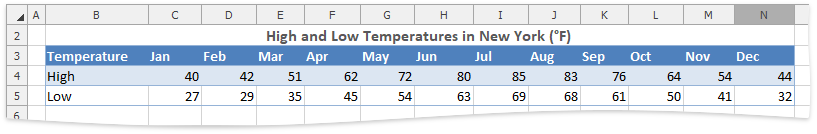
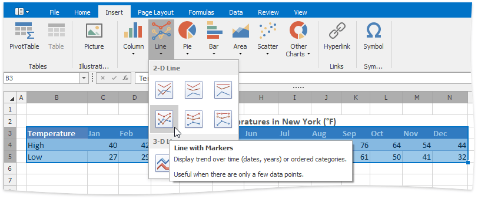
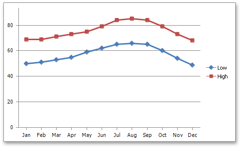

# Creating a Chart
The **Spreadsheet** allows you to create charts quickly using the **Charts** group of the **Insert** tab.

To create a chart, select the table that contains the data you wish to use for the chart. Note that the **Spreadsheet** only allows you to create charts for data series representing a contiguous cell range.

In the **Charts** group within the **Insert** tab, select the required chart type. In the example below, a line chart is created. To insert a line chart, click the **Line** button, and then select the **Line with Markers** chart subtype.

The chart is added to the worksheet. You can move the chart to the desired location and resize it for a better fit.

