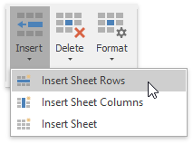
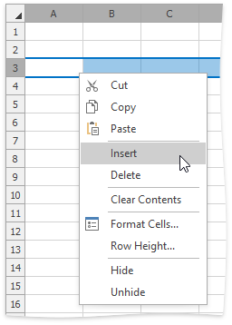
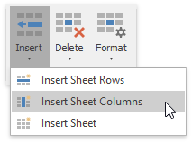
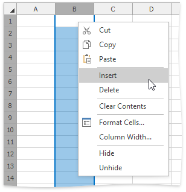
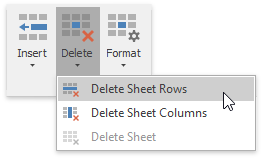

# Insert and Delete Columns and Rows
The **Spreadsheet** provides the capability to insert and delete columns and rows in a worksheet.

## Insert Rows
1. To insert a single row, [select](../editing-cells/select-cells-or-cell-content.md) the entire row by clicking the row heading, or click a cell in the row above the position in which you wish to insert a new row. To insert multiple rows, [select](../editing-cells/select-cells-or-cell-content.md) the number of rows you wish to insert. For example, if you wish to insert three rows, select three rows by clicking the row headings.
2. Do one of the following.
	* In the **Cells** group within the **Home** tab, click the **Insert** button and select the **Insert Sheet Rows** item from the drop-down list.
		
		
	* Right-click a cell within the selected row(s) and click the **Insert** item in the invoked menu. The new row(s) will be inserted above the selected row(s).
		
		

## Insert Columns
1. To insert a single column, [select](../editing-cells/select-cells-or-cell-content.md) the entire column by clicking the column heading, or by clicking a cell in the column to the left of where the new column will be inserted. To insert multiple columns, [select](../editing-cells/select-cells-or-cell-content.md) the number of columns you wish to insert. For example, to insert three columns, select three columns by clicking column headings.
2. Do one of the following:
	* In the **Cells** group within the **Home** tab, click the **Insert** button and select the **Insert Sheet Columns** item from the drop-down list.
		
		
	* Right-click a cell within the selected column(s) and click the **Insert** item in the invoked menu. The new column(s) will be inserted to the left of the selected column(s).
		
		

## Delete Rows and Columns
1. Select the column(s) or row(s) you wish to delete by clicking its heading.
2. Do one of the following.
	* In the **Cells** group within the **Home** tab, click the **Delete** button and select the **Delete Sheet Rows** or **Delete Sheet Columns** item from the drop-down list.
		
		
	* Right-click a cell within the selected column(s) or row(s), and then click the **Delete** item in the invoked menu. The specified column(s) or row(s) will be deleted.