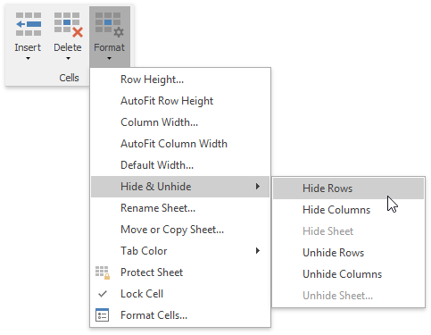

# Show and Hide Columns and Rows
The **Spreadsheet** provides the capability to display and hide columns and rows in a worksheet.

## Hide and Unhide Columns
1. [Select](../editing-cells/select-cells-or-cell-content.md) the column to be hidden.
2. Do one of the following:
	* Set the column width to zero. To do this, drag the boundary of the column heading until the column is hidden;
	* On the **Home** tab, in the **Cells** group, click the **Format** button and select **Hide &amp; Unhide | Hide Columns**;
		
		
	* Right-click the selected column and select the **Hide** item from the context menu.
3. To show the column you hid, select the columns adjoining to either side of the hidden column, and then do one of the following:
	* On the **Home** tab, in the **Cells** group, click the **Format** button, and then select **Hide &amp; Unhide | Unhide Columns**;
	* Right-click the selected columns and select the **Unhide** item from the context menu.
		
		

## Hide and Unhide Rows
1. Select the row to be hidden.
2. Do one of the following:
	* Set the row height to zero. To do this, drag the boundary of the row heading until the row is not displayed;
	* On the **Home** tab, in the **Cells** group, click the **Format** button and select **Hide &amp; Unhide | Hide Rows**;
		
		
	* Right-click the selected row and select the **Hide** item from the context menu.
3. To display the row you hid, select the rows that are above and below the hidden row, and then do one of the following:
	* On the **Home** tab, in the **Cells** group, click the **Format** button, and then select **Hide &amp; Unhide | Unhide Rows**;
	* Right-click the selected rows and select the **Unhide** item from the context menu;
		
		

## Display all hidden columns and rows
1. Click the **Select all** button at the intersection of the column and row headings, or press **CTRL+A**.
2. Do one of the following:
	* On the **Home** tab, in the **Cells** group, click the **Format** button, and then select **Hide &amp; Unhide | Unhide Rows** or **Unhide Columns**;
	* Right-click the selection and select the **Unhide** item from the context menu.