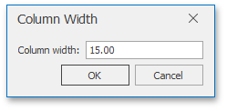
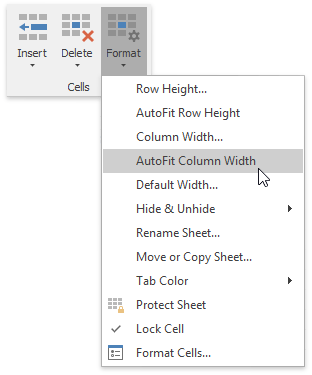
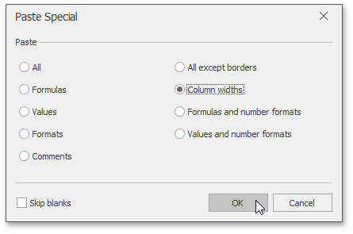
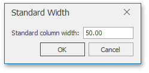
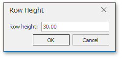
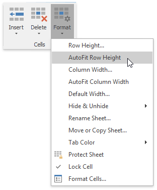

# Specify Column Width and Row Height
## Setting the column width
In the **Spreadsheet**, the column width can vary from 0 to 255 characters of the default font specified by the predefined _Normal_ style. The default column width is 8.43 characters. If you set the column width to 0, the column will be hidden.

To change the column width, do one of the following.
1. Drag the right boundary of the column header to resize a column’s width. To set the width of multiple columns, select these columns, and then drag the right boundary of one of the selected columns.
2. To set the column width to a specific value, select the column whose width you wish to change, and on the **Home** tab, in the **Cells** group, click **Format** | **Column Width...**
	
	Type the required width value in the invoked **Column Width** dialog.
	
	
3. To change the column width to automatically fit the contents, select the column and do one of the following.
	* On the **Home** tab in the **Cells** group, click the **Format** button and select the **AutoFit Column Width** item from the drop-down list.
		
		
	* Double-click the right boundary of the selected column.
4. To match one column’s width to another column, do the following.
	* Select the column whose width you want to copy.
	* On the **Home** tab, in the **Clipboard** group, click the **Copy** button or press CTRL+C.
	* Click the cell in the column that is to be resized, and then click the **Paste Special** button in the **Clipboard** group. In the **Paste Special** dialog box that is invoked, select the **Column widths** item.
		
		
5. To change the default width for all columns in a worksheet, on the **Home** tab in the **Cells** group, click the **Format** button and select the **Default Width...** item from the drop-down list.
	
	In the invoked **Standard Width** dialog, type a new number for the default column width.
	
	

## Set the row height
In the **Spreadsheet**, the row height should be between 0 and 409 points. The default row height is 12.75 points. If you set the row height to 0, the row is hidden.

To change the row height, do one of the following.
1. Drag the lower boundary of the row header until the row reaches your desired height. To set the height of multiple rows, select them, and then drag the lower boundary of any selected row.
2. To set the row height to a specific value, select the row whose height you wish to change, and on the **Home** tab in the **Cells** group, click **Format** | **Row Height...**
	
	Type the required height value in the invoked **Row Height** dialog.
	
	
3. To change the row height to automatically fit the contents, select the row and do one of the following.
	* On the **Home** tab in the **Cells** group, click the **Format** button and select the **AutoFit Row Height** item from the drop-down list.
		
		
	* Double-click the lower boundary of the selected row.