# Filter Data
The **Spreadsheet** allows you to use the AutoFilter to arrange large amounts of data by displaying only rows that meet the filtering criteria.

To enable the filtering functionality, select the required data, and on the **Data** tab, in the **Sort &#38; Filter** group, click the **Filter** button.
 
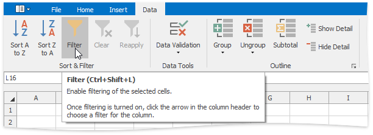

Once filtering is activated, a drop-down arrow  appears on the right side of each column header in the range. Depending on the data in the column you wish to filter, you can apply one of the following filters: Filter by Values, Text Filter, Number Filter or Date Filter.

> [!NOTE]
> You can filter your data by multiple columns. Filters are **additive**: each new filter is applied in addition to the existing filters and further reduces your data.

* [Filter by Values](#filtervalues)
* [Text Filter](#textfilter)
* [Number Filter](#numberfilter)
* [Date and Time Filter](#datefilter)
* [Reapply a Filter](#reapplyfilter)
* [Clear a Filter](#clearfilter)

## <a name="filtervalues"/>Filter by Values
To filter your data by a list of values, do the following.
1. Click the arrow  in the header of the column containing the values you wish to filter.
2. In the drop-down menu, select the **Filter by Values** item to invoke the **AutoFilter** dialog.
	
	
3. The **AutoFilter** dialog displays a list of all values in the selected column. Click the **Uncheck All** button to deselect the values. Then, select the check boxes for the items you wish to display, and click **OK**.
	
	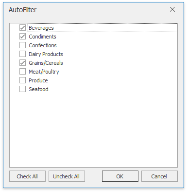

## <a name="textfilter"/>Text Filter
To apply the text filter, do the following.
1. Click the arrow  in the header of the column containing text values you wish to filter.
2. Point to **Text Filters** and select one of the built-in comparison operators, or select **Custom Filter** to construct your own filter expression.
	
	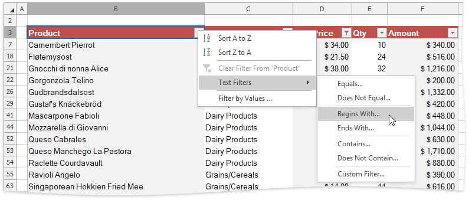
3. In the invoked **Custom AutoFilter** dialog specify the filter criterion.
	
	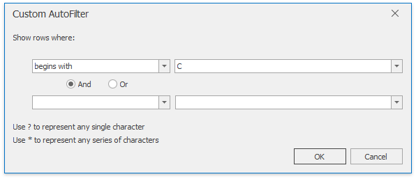
	
	You can also specify the additional filter criterion using the **AND** or **OR** logical operator to combine the conditions.
	
	To make your filter criterion more flexible, use the **wildcard characters**. The asterisk **&#42;** matches any number of characters, while the question mark **?** represents a single character. For example, to display all the values that start with the letter &quot;**C**&quot;, you can either use the **Begins With** operator as shown in the image above, or select the **Equals** operator and type &quot;**C&#42;**&quot; in the box on the right.
	
	> [!TIP]
	> To filter values containing a specific character, such as the asterisk, question mark or tilde, put the tilde (&#126;) before it.

## <a name="numberfilter"/>Number Filter
To apply the number filter, do the following.
1. Click the arrow  in the header of the column containing numeric values you wish to filter.
2. Point to **Number Filters** and select one of the built-in comparison operators (**Equals**, **Greater Than**, **Less Than**, **Between**, **Top 10**, **Above** or **Below Average**, etc.), or select **Custom Filter** to construct your own filter expression.
	
	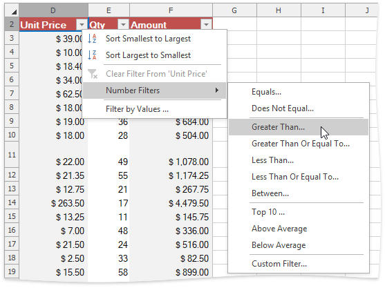
3. In the invoked **Custom AutoFilter** dialog specify the filter criterion.
	
	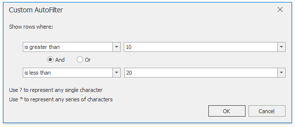
	
	You can also specify the additional filter criterion using the **AND** or **OR** logical operator to combine the conditions.

## <a name="datefilter"/>Date and Time Filter
To apply the date filter, do the following.
1. Click the arrow  in the header of the column containing dates you wish to filter.
2. Point to **Date Filters** and select one of the built-in dynamic filter types to display dates that fall within a specified time period (next, this or last week, month, year, etc.)...
	
	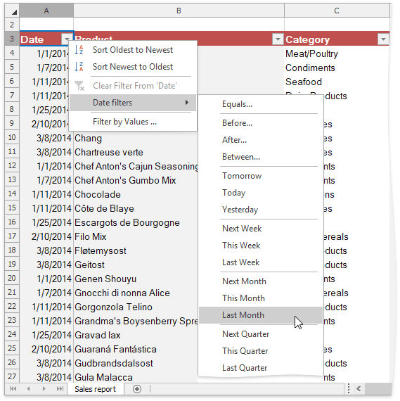
	
	... or select the **Before**, **After**, **Equals** or **Between** item to invoke the **Custom AutoFilter** dialog and find dates that are before, after or equal to the specified date, or between two dates.
	
	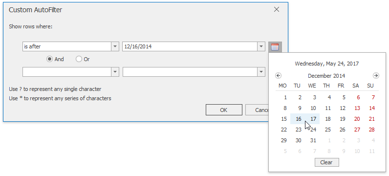

## <a name="reapplyfilter"/>Reapply a Filter
To reapply a filter after you change your data, click a cell in the range or table to which the filter is applied, and then on the **Data** tab, in the **Sort &#38; Filter** group, click the **Reapply** button.

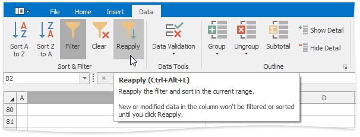

## <a name="clearfilter"/>Clear a Filter
To remove a filter, do the following.
* To remove a filter from a specific column, click the **Filter** button  in the column header, and then select the **Clear Filter From &#39;Column Name&#39;** item in the drop-down menu.
	
	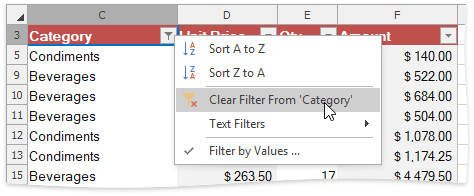
* To clear all the specified filters and display the hidden rows, on the **Data** tab, in the **Sort &#38; Filter** group, click the **Clear** button.
	
	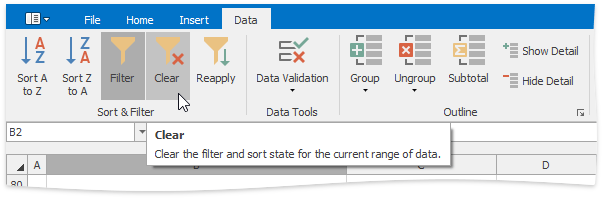

To disable the filtering functionality, click a cell in the range or table, and then on the **Data** tab, in the **Sort &#38; Filter** group, click the **Filter** button. The drop-down arrows will disappear from the column headers and all the specified filters will be removed.