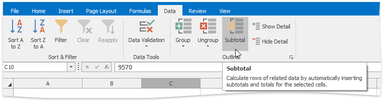
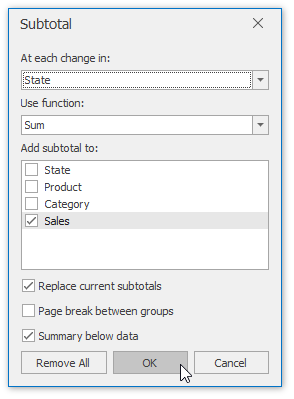
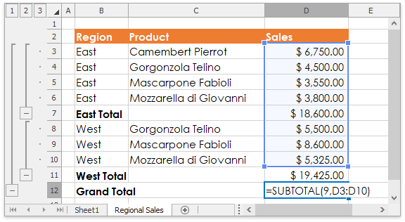

# Subtotal Data
The **Spreadsheet** allows you to automatically [group](outline-data.md) related data in a worksheet and add summary rows to each group using the **SUBTOTAL** function.

> [!IMPORTANT]
> Before subtotaling, it is necessary to ensure that the range to be subtotaled contains similar data in each column, has column headings in the first row and does not include blank rows or columns.

To insert subtotals for the selected range, follow the steps below.
* On the **Data** tab, in the **Outline** group, click the **Subtotal** button.
	
	
* In the invoked **Subtotal** dialog, specify the required subtotal options.
	
	
	* In the **At each change in** drop-down list, select the heading of the column by which the data should be grouped. Each time a value in this column changes, a new subtotal row is inserted. So [sorting](sort-data.md) your data by this column is recommended to ensure that the same column values will be in one group.
	* In the **Use function** drop-down list, select one of the eleven functions available for calculating subtotals: Sum, Count, Average, Max, Min, etc.
	* In the **Add subtotals to** box, select the check boxes corresponding to the columns for which the SUBTOTAL function should be calculated.
	* Select the **Replace current subtotals** check box to replace the existing subtotals with the recently specified subtotals. If you wish to create more than one level of subtotals (for example, to insert subtotals for the inner groups using different summary functions), clear this check box.
	* Select the **Page break between groups** check box to locate each group on a new page. It can be useful if your groups contain many detail rows and you wish to separate them while printing.
	* Select the **Summary below data** check box to display a summary row below detail rows in each group. Otherwise, the summary row will be displayed at the top of the group.

Since subtotals are specified, you can change the SUBTOTAL function directly in the cell or formula bar to ignore values in the collapsed groups. To do this, add **100** to the first numeric function's argument, which specifies the code of the function used in calculating subtotals. In this case, the hidden values in the collapsed group will not be taken into account during calculations.

To remove subtotals, select a cell in the subtotaled range, invoke the **Subtotal** dialog and click the **Remove All** button.