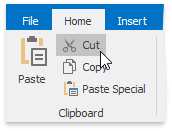
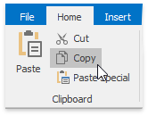
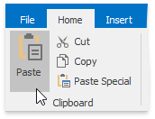

# Copy and Paste Cell Content
The **Spreadsheet** allows you to copy and paste entire cells, or only their contents, using the Clipboard.

To move or copy cell content, follow the steps below.
1. [Select](select-cells-or-cell-content.md) the cells that you wish to move or copy.
2. In the **Clipboard** group within the **Home** tab, do one of the following.
	* To move the selected cells, click the **Cut** button (or press **CTRL+X** or **SHIFT+DELETE**).
		
		
	* To copy the selected cells, click the **Copy** button (or press **CTRL+C** or **CTRL+INSERT**).
		
		
3. Click the upper-left cell in the area where you wish to paste the copied cells.
4. In the **Clipboard** group within the **Home** tab , click the **Paste** button (or press **CTRL+V** or **SHIFT+INSERT**).
	
	
	
	To choose special options when you paste cells, in the **Clipboard** group within the **Home** tab, click the **Paste Special** button (or press **CTRL+ALT+V**).
	
	
	
	In the invoked **Paste Special** dialog box, select one of the following options.
	* **All** - paste all cell content and formatting.
	* **Formulas** - only paste formulas, as entered in the **Formula Bar**.
	* **Values** - only paste cell values.
	* **Formats** - only paste cell formatting.
	* **Comments** - only paste the comments added to the cells.
	* **All except borders** - paste cell content and formatting without cell borders.
	* **Column widths** - paste the column widths of the copied cells to another range of columns.
	* **Formulas and number formats** - only paste formulas and number formatting options from the copied cells.
	* **Values and number formats** - only paste values and number formatting options from the copied cells.
	* **Skip blanks** - avoid replacing values in the paste area when the copy area includes blank cells.