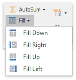

# Fill Data Automatically
The **Spreadsheet** provides the capability to fill adjacent cells with data automatically.

To fill a selected cell or a range of cells with the data contained in adjacent cells, do the following.
1. [Select](select-cells-or-cell-content.md) the cell (or range of cells) adjacent to the cell (or range of cells) of the data you wish to repeat.
2. In the **Editing** group within the **Home** tab, click the **Fill** button and select one of the following items from the drop-down list.
	
	
	* **Fill Down** (or press **CTRL+D**) - pastes the contents of the cell that is above the selected cell, or pastes the contents of the topmost cell in the selected range to the cells below.
	* **Fill Up** - pastes the contents of the cell below the selected cell, or pastes the contents of the lowermost cell in the selected range to the cells above.
	* **Fill Right** (or press **CTRL+R**) - pastes the contents of the cell or cell range to the left of the selected cell(s).
	* **Fill Left** - pastes the contents of the cell or cell range to the right of the selected cell(s).