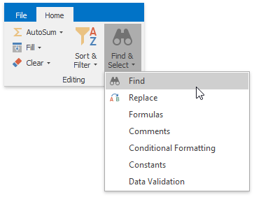
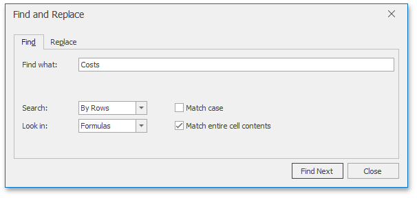
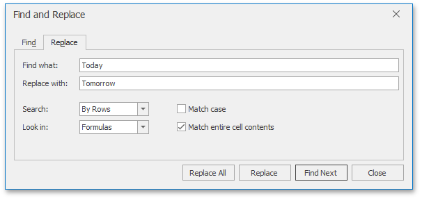

# Find and Replace
The **Spreadsheet** allows you to search for specific data in the current worksheet. To perform a search, on the **Home** tab, in the **Editing** group, click the **Find &#38; Select** button. The button's drop-down menu will be displayed.

Next, do one of the following.
* Click **Find** in the **Find &#38; Select** drop-down menu (or press **CTRL**+**F**) to perform a search in the active worksheet. The **Find and Replace** dialog (with the **Find** tab activated) will be invoked.
	
	
	
	In the **Find what** field, enter the text or number you wish to find, and click the **Find Next** button to start the search. To define the direction of the search, in the **Search** field, select the **By Rows** or **By Columns** drop-down item. In the **Look in** field, select **Values** (to search cell values only) or **Formulas** (to search cell values and formula expressions, excluding the calculated results). To perform a case-sensitive search, select the **Match Case** check box. To restrict the search to the entire cell content, select the **Match entire cell contents** check box.
* Click **Replace** in the **Find &#38; Select** drop-down menu (or press **CTRL**+**H**) to search for a text string and optionally replace it with another value. The **Find and Replace** dialog (with the **Replace** tab activated) will be invoked.
	
	
	
	To replace a value, enter the search term in the **Find what** field and the replacement text for this search term in the **Replace with** field, and then click the **Find Next** button to find the first occurrence of the search term. Next, click the **Replace** button to replace only the value of the selected matching cell, or **Replace All** to replace all occurrences of the search term. Note that the **Replace** tab provides the same search options as the **Find** tab, with one exception: you can only select the **Formulas** drop-down item in the **Look in** box, so only the underlying formulas (not the calculated results) will be examined when searching for matches to your search term.