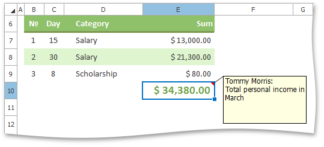
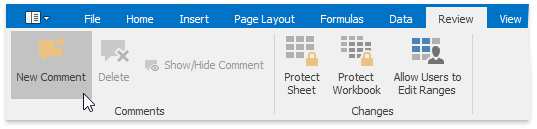
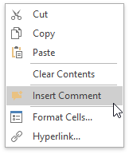
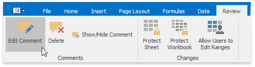
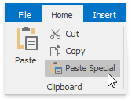
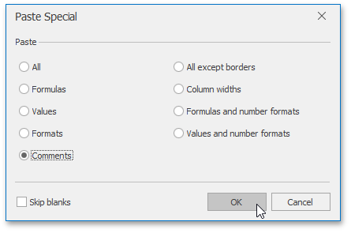
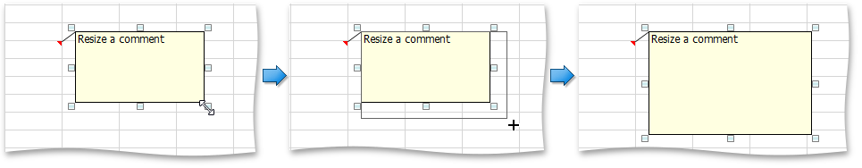
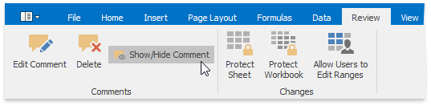
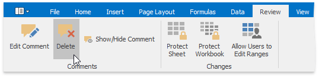

# Insert a Comment
The **Spreadsheet** allows you to attach notes to individual cells by using **comments**. Comments are extremely useful when you need to provide additional information, such as reminders, notifications, or feedback in a document without modifying cell content.

Comments are displayed in a yellow box anchored to a cell. A cell containing a comment has a red triangular indicator in the corner.

You can [add](#addcomment) new comments, [edit](#editcomment) existing comments, [copy](#copycomment) comments to other cells, [move and resize](#movecomment) the comment box, [hide](#hidecomment) or [delete](#deletecomment) comments if they are no longer needed.

## <a name="addcomment"/>Add a Comment
To insert a new comment, select the cell where you wish to place the comment, and do one of the following.
* On the **Review** tab, in the **Comments** group, click the **New Comment** button.
	
	
* Right-click the cell and select the **Insert Comment** item in the context menu.
	
	
* Press **SHIFT**+**F2**.

The new comment will be anchored to the cell. Type the desired text within the comment box. By default, the comment is accompanied by the user name of the person who created the comment. If you wish to change the default name, delete it and type a new name.

## <a name="editcomment"/>Edit a Comment
1. Select the cell that contains the comment you wish to edit.
2. Do one of the following.
	* On the **Review** tab, in the **Comments** group, click the **Edit Comment** button...
		
		
		
		... or right-click the cell and select the **Edit Comment** item in the context menu.
		
		The comment will be activated and the cursor will be positioned within the comment box. Change the comment text as needed.
	* Click inside the comment box, and start editing the comment text.
		
		> [!TIP]
		> If the comment is hidden, click the **Show/Hide Comment** button to display the comment.

## <a name="copycomment"/>Copy Comments Only
1. Select the cell(s) containing the comment(s) you wish to copy.
2. On the **Home** tab, in the **Clipboard** group, click **Copy**, or press **CTRL+C**.
3. Select the top-left cell of the destination area where you wish to insert the copied comment(s).
4. On the **Home** tab, in the **Clipboard** group, click the **Paste Special** button, or press **CTRL+ALT+V**.
	
	
5. In the invoked **Paste Special** dialog, click **Comments**, and then click **OK**.
	
	

## <a name="movecomment"/>Move and Resize a Comment
1. Select the cell that contains the comment you wish to move or resize.
	
	> [!TIP]
	> If the comment is hidden, click the **Show/Hide Comment** button to display the comment.
2. Click the comment box border to display the **sizing handles** (small rectangles at the corners and sides of the comment box).
3. Do one of the following.
	* To move a comment, hover the mouse over the comment border so that the four-way resize arrow appears, and drag the comment to a new location.
		
		
	* To resize a comment, click one of the sizing handles and drag the edge of the comment box.
		
		

## <a name="hidecomment"/>Display or Hide a Comment
1. Select the cell that contains the comment you wish to display or hide.
2. Do one of the following.
	* On the **Review** tab, in the **Comments** group, click the **Show/Hide Comment** button.
		
		
	* Right-click the cell and select the **Show/Hide Comment** item in the context menu.

## <a name="deletecomment"/>Remove a Comment
To delete the existing comment, do the following.
1. Select the cell that contains the comment you wish to delete.
2. Do one of the following.
	* On the **Review** tab, in the **Comments** group, click the **Delete** button.
		
		
	* Right-click the cell and select the **Delete Comment** item in the context menu.