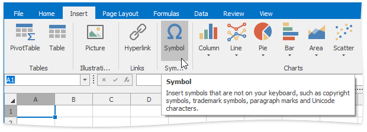
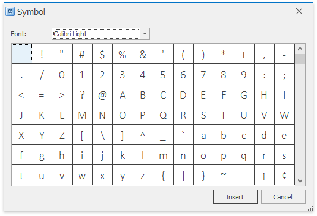

# Insert a Symbol
The **Spreadsheet** allows you to insert symbols and special characters that are not on your keyboard, such as ASCII or Unicode characters, fractions (&#188;), copyright symbol (&#169;), trademark symbols (&#174;, &#8482;), paragraph mark (&#182;), etc.

To insert a symbol, follow the instructions below.
1. Move to the cell where you wish to insert a symbol.
2. On the **Insert** tab, in the **Symbols** group, click the **Symbol** button.
	
	
	
	The **Symbol** dialog will be invoked.
	
	
3. Select the symbol you wish to insert and click **Insert**, or double-click the symbol.