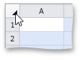
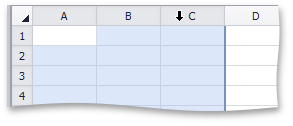

# Select Cells or Cell Content
## Selecting Cells
To select cells in the **Spreadsheet**, use the following mouse actions and keyboard shortcuts.
1. To select a **single cell**, click the cell or press the arrow keys to move to the required cell.
2. To select a **range of cells**, do one of the following.
	* Click the first cell in the range and drag it to the last cell.
	* Hold down the **SHIFT** key, and then press the arrow keys to extend the selection.
	* Click the first cell in the range, hold down the **SHIFT** key, and then click the last cell in the range.
3. To select the **entire worksheet**, click the **Select All** button at the intersection of the column and row headings, or press **CTRL+A**.
	
	
4. To select **nonadjacent cells**, hold down the **CTRL** key, and then select other cells.
5. To select an **entire row or column**, click the row or column heading.
	
	
6. To select **multiple columns or rows**, drag across the row or column headings.
	
	
7. To select **several nonadjacent rows or columns**, click the heading of the first row or column in the selection, hold down **CTRL**, and then click the headings of other rows or columns you wish to select.

The following table lists the default keyboard shortcuts used for selecting cells in the **Spreadsheet**.

|  |  |
|---|---|
| CTRL+RIGHT ARROW | Selects the last cell in a row. |
| CTRL+LEFT ARROW | Selects the first cell in a row. |
| CTRL+DOWN ARROW | Selects the last cell in a column. |
| CTRL+UP ARROW | Selects the first cell in a column. |
| CTRL+HOME | Selects the first cell on a worksheet. |
| CTRL+END | Selects the last cell that contains data or formatting on a worksheet. |
| CTRL+A | Selects the entire worksheet. |
| CTRL+SHIFT+END | Extends the selection to the last used cell on a worksheet. |
| CTRL+SHIFT+HOME | Extends the selection to the beginning of the document. |

## Selecting Cell Content
To select the cell content, do one of the following:
* Double-click the cell, and then drag across the cell content you wish to select.
* Press **F2**, and then drag across the contents of the cell you wish to select, or press **SHIFT+LEFT ARROW** to select the cell content.
* Click the cell, and then drag across the cell content you wish to select in the **Formula Bar**.