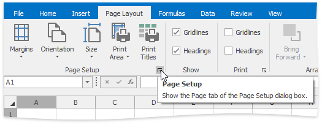
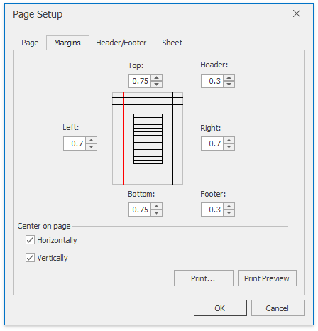
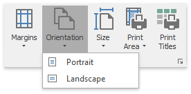
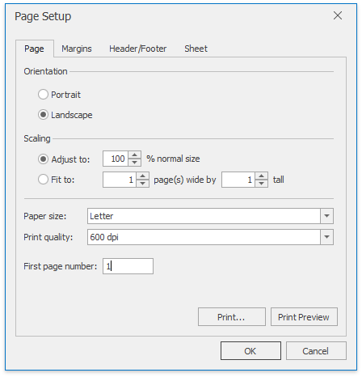
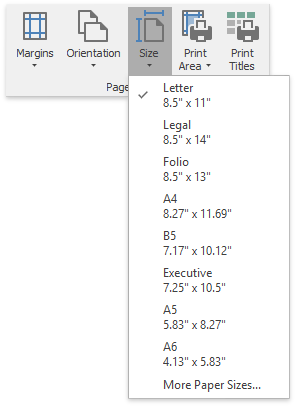
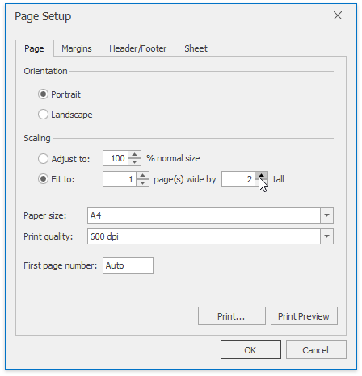

# Adjust Page Settings
Before you print a worksheet, you can change page layout settings such as [page margins](#margins), [page orientation](#orientation), [paper size](#size) and [scaling](#scale).

## <a name="margins"/>Set Page Margins
1. Click the worksheet for which you wish to set the page margins.
2. In the **Page Setup** group within the **Page Layout** tab, click the **Margins** button and select the margin sizes to be set for the current worksheet.
	
	
3. To specify custom margins, select **Custom Margins...** in the drop-down list...
4. ... or click the **Page Setup** Dialog Box Launcher and switch to the **Margins** tab in the invoked dialog.
	
	
5. Specify desired margin sizes in the corresponding dialog boxes. To center worksheet data on a printed page, check the corresponding **Center on page** section boxes.
	
	

## <a name="orientation"/>Set Page Orientation
1. Click the worksheet for which you wish to specify page orientation.
2. In the **Page Setup** group within the **Page Layout** tab, click the **Orientation** button and select **Portrait** or **Landscape** from the invoked drop-down list...
	
	
3. ... or invoke the **Page Setup** dialog by clicking the **Page Setup** box launcher and select the desired page orientation.
	
	

## <a name="size"/>Change Paper Size
1. Click the worksheet for which you wish to set the paper size.
2. In the **Page Setup** group within the **Page Layout** tab, click the **Size** button and select one of the predefined paper sizes from the invoked drop-down list.
	
	
3. Click **More Paper Sizes...** to set more advanced paper size settings.
	
	

<a name="scale"/>

## Scale a Worksheet
If your worksheet has a lot of columns, you can scale it to reduce the size of the worksheet to better fit the printed page.

On the **Page Layout** tab, in the **Page Setup** group, click the **Dialog Box Launcher**.

In the invoked dialog, in the **Scaling** section, click **Adjust to** and specify the percentage of the original size that you wish to use.

To accommodate the worksheet to a specific number of pages, select **Fit to:** and specify the number or pages wide and tall.

