# Print a Workbook
This document includes the following sections:
* [Preview a Workbook before Printing](#preview)
* [Print a Workbook](#print)
* [Print a Workbook Using the Default Settings](#printdefault)
* [Print Gridlines and Headings](#printgridlines)
* [Print Comments](#comments)
* [Change Print Resolution and Quality](#quality)
* [Set a Print Area](#printarea)
* [Set Print Titles](#printtitles)
* [Add Headers and Footers to a Worksheet Printout](#headersfooters)

<a name="preview"/>

## Preview a Workbook Before Printing
To view your workbook as it will be printed, select the **File** tab and click the **Print Preview** button in the **Common** group. 

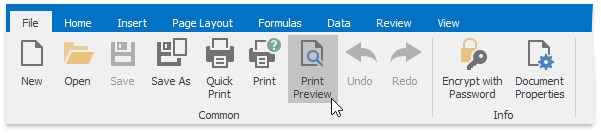

At the bottom of the **Preview** window, the **Spreadsheet** indicates how many pages the workbook will require when printed, and the number of the page you are currently viewing.

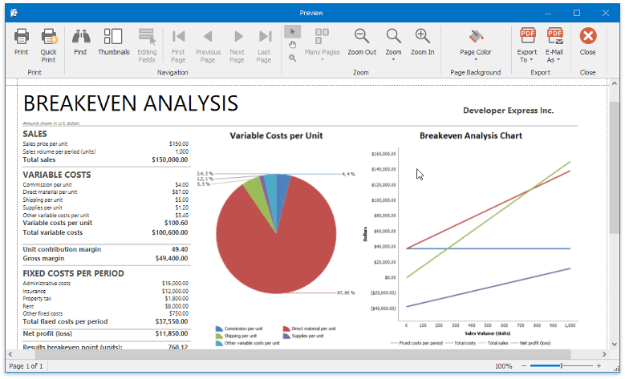

<a name="print"/>

## Print a Workbook
To print a document, click the **Print** button in the **Common** group or press **CTRL+P**.

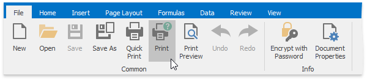

In the invoked **Print** dialog box, specify the required settings and click **Print**.

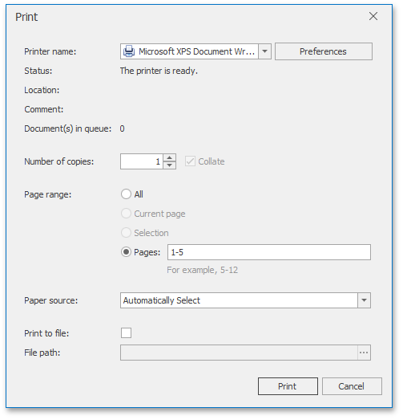

<a name="printdefault"/>

## Print a Workbook Using the Default Settings
To send a workbook directly to the default printer without setting print options, click the **Quick Print** button in the **Common** group.

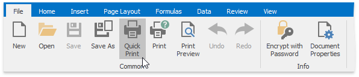

<a name="printgridlines"/>

## Print Gridlines and Headings
To print worksheet gridlines or row/column headings, on the **Page Layout** tab, in the **Print** group, check the **Gridlines** and **Headings** boxes...

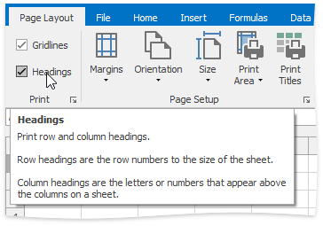

...or click the **Dialog Box Launcher**. In the invoked **Sheet** tab of the **Page Layout** dialog, check the **Gridlines** and **Row and column headings** boxes.

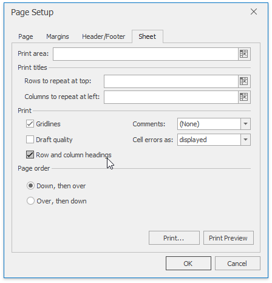

<a name="comments"/>

## Print Comments
The SpreadsheetControl doesn't print comments by default. To enable printing comments, do the following.
* On the **Page Layout** tab, in the **Print** group, click the **Dialog Box Launcher**.
* In the invoked **Sheet** tab of the **Page Setup** dialog, click the **Comments** drop-down menu and select **As displayed on sheet**. To print the comments on a separate sheet of paper, select **At end of sheet**.
	
	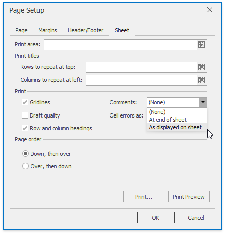

<a name="quality"/>

## Change Print Resolution and Quality
Depending on the used printer, you can change the resolution settings to a lower or higher dpi (dots-per-inches) setting. Invoke the **Page Setup** dialog by clicking the Dialog Box Launcher in the **Page Setup** group.

On the **Page** tab, select the desired resolution from the **Print Quality** box.

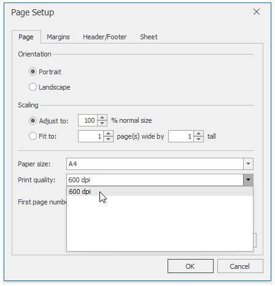

Additionally, you can print your worksheet without graphics (this is useful when it is necessary to accelerate printing and save toner). To do that, switch to the **Sheet** tab and check **Draft quality** box.

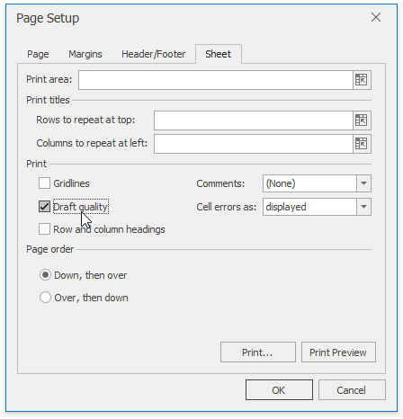

<a name="printarea"/>

## Set a Print Area
If you need to print only a specific part of the worksheet, you can define the target cell range as a **print area**. To do that, do the following:
1. Select the cells you wish to print.
2. On the **Page Layout** tab, in the **Page Setup** group, click the **Print Area** button and select **Set Print Area** in the invoked drop-down menu.
	
	
3. ... or click the **Page Setup** box launcher to invoke the **Page Setup** dialog, switch to the **Sheet** tab and specify the print area in  the **Print area** box. You can type the cell reference or define the range directly in a worksheet by clicking the **Collapse Dialog**  button.
	
	
4. When you specify the print area, the cell range that it comprises gets a thin dashed outline and the **_xlnm.Print_Area** name is added to the collection of the defined names contained in the workbook.
	
	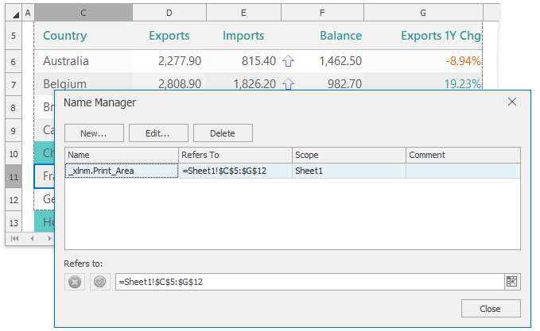
5. To extend the print area, select the select the cell range you wish to add and click **Print Area** | **Add to Print Area** in the **Page Setup** group. Note that if the print area consists of non-adjacent cell ranges, each range will be printed as a separate page.
	
	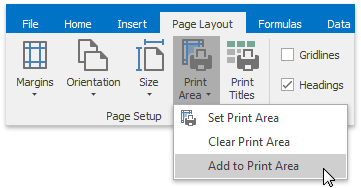
6. To clear the print area and print the entire worksheet, on the **Page Layout** tab, in the **Page Setup** group, click **Print Area** | **Clear Print Area**.

<a name="printtitles"/>

## Set Print Titles
If a worksheet occupies more than one page, you can repeat specific row or column (print titles) on every printed page to make the document easier to read. To define print titles, follow the steps below.
1. On the **Page Layout** tab, in the **Page Setup** group, click the **Print Titles** button...
	
	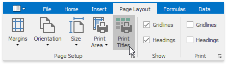
2. ... or  to invoke the **Page Setup** dialog and switch to the **Sheet** tab.
	
	
3. Specify the reference to the row/column containing labels that should be repeated in the **Rows to repeat at top** and/or **Columns to repeat at left** boxes of the **Print titles** section. You can select the target row or column directly in a worksheet by clicking the collapse dialog  button.
	
	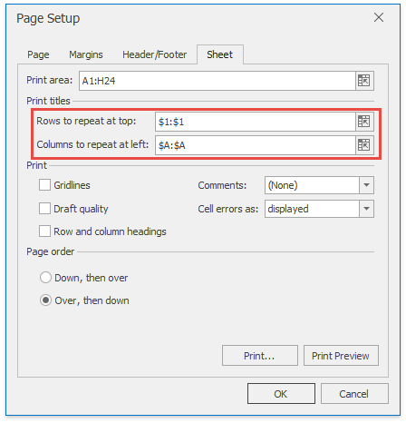

<a name="headersfooters"/>

## Add Headers and Footers to a Worksheet Printout
You can set a header and footer for a worksheet printout by doing the following.
1. On the **Page Layout** tab, in the **Page Setup** group, click the **Page Setup** box launcher.
	
	
2. In the invoked **Page Setup** dialog, switch to the **Header/Footer** tab.
3. Select one of the predefined options in the **Header** or **Footer** drop-down list.
	
	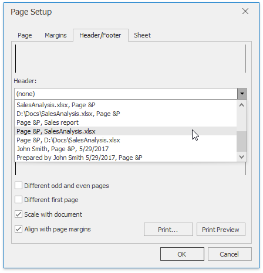
4. To specify custom header and/or footer, click the **Custom Header/Footer...** button to invoke the **Header and Footer** dialog.
	
	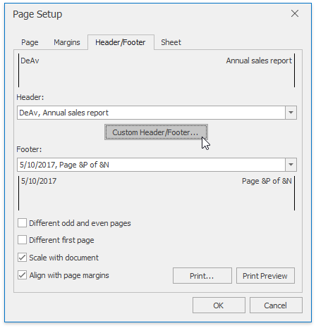
5. Click in the **Left**, **Center**  or **Right** section box and type the desired text. Use the buttons located between the header and footer sections to insert specific codes that enable including dynamic information into a header or footer, such as a page number, current date and time, filename, worksheet name, etc.
	
	To insert a picture to the worksheet header or footer, click the **Insert Picture** button and select the desired file in the invoked **Open** dialog. To format the image so it fits the header/footer area, click the **Format Picture** button.
	
	