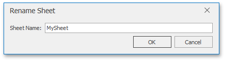

# Rename a Worksheet
When a new worksheet is created, the **Spreadsheet** assigns it a generic name, such as _Sheet1_, _Sheet2_, etc.

To rename a worksheet, double-click its sheet tab on the **Sheet tab** bar to invoke the **Rename Sheet** dialog box, or ...

... right-click the sheet tab of the worksheet and select the **Rename** item from the invoked menu. Rename the worksheet and click **OK**.

The **Spreadsheet** sets the following rules for a valid worksheet name.
* The maximum length of a worksheet name is 31 characters.
* A worksheet name must not be an empty string.
* A worksheet name must not include the following characters: **\**, **/**, **?**, **:**, *****, **[**, **]**.
* A worksheet name must not start or end with a single quote.
* A worksheet name must not be equal to a name of another existing worksheet.