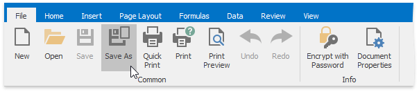
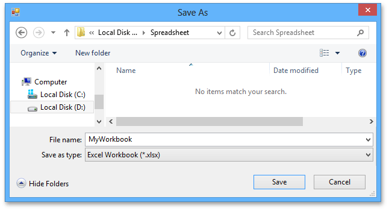

# Save a Workbook
To save a workbook, go to the **File** tab, and then click the **Save as** button in the **Common** group,  or press **F12** instead of these steps.

After that, the **Save as** dialog box is invoked.

Specify the location and the file format in which to save the workbook.

The available file formats in the **Save as** dialog box are the following.
* Excel Workbook (*.xlsx)
* Excel Macro-Enabled Workbook (*.xlsm)
* Excel 97-2003 Workbook (*.xls)
* Excel Template (*.xltx)
* Excel Macro-Enabled Template (*.xltm)
* Excel 97-2003 Template (*.xlt)
* Tab-delimited Text File format (*.txt)
* Comma-separated Values File format (*.csv)

To save the active workbook with its current file format and location, go to the **File** tab, and then click the **Save** button in the **Common** group,  or press **CTRL+S** instead. If you click the **Save** button to save a newly created workbook, the **Save as** dialog is invoked.