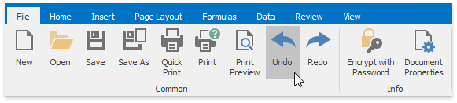
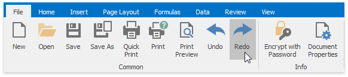

# Undo and Redo Last Actions
The **Spreadsheet** allows you to undo or redo your last performed action.

To undo an action, select the **File** tab, and click the **Undo** button in the **Common** group (or press **CTRL+Z** or **ALT+BACKSPACE**).

To redo an action that you undid, click the **Redo** button in the **Common** group (or press **CTRL+Y** or **ALT+SHIFT+BACKSPACE**).

