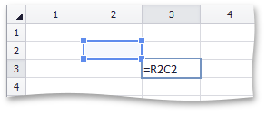

# Cell References
## The A1 Reference Style
If you want to change data in a worksheet without changing formulas that use this data for evaluation, you can use **cell references**. A cell reference defines cell location in a worksheet. It is a combination of column letters (**A, B, C,** etc.) and row numbers (**1, 2, 3,** etc.). For example, **A1** refers to a cell at the intersection of column A and row 1.

To add values in cells A1 and A2, and divide the result by the value in cell A3, type the following formula (use parentheses to determine the order of operations):

### =(A1+A2)/A3

You can also use a reference to a cell located in another worksheet. For example, to multiply a value in cell B1 by the value in cell B1 in _Sheet 2_, enter the following formula:

### =B1*Sheet2!B1

To prevent data from changing when the formula is copied, use the **absolute reference**. Absolute references have a dollar sign ($) before column and/or row references.

The following example demonstrates how to use a constant value in cell B1 in calculations:

### =A1*$B$1

## The R1C1 Reference Style
The **Spreadsheet** supports the **R1C1 reference style** where both rows and columns are labeled with numbers. Cell location is indicated by an "R" letter followed by a row number and a "C" letter followed by a column number.

You can use **absolute** and **relative** R1C1 references. An absolute R1C1 reference always refers to a cell in a specific location.

The example below demonstrates how to create a formula that adds values in cells A1 through A5 using the absolute R1C1 reference style:

### =SUM(R1C1:R5C1)

A relative R1C1 reference refers to a cell location in relation to an active cell.

The image below illustrates a relative reference to a cell one row above and one column to the left of the active cell.

The following example demonstrates how to create a formula that adds values in cell range A1:A5 using the relative R1C1 reference style in cell B1:

### =SUM(RC[-1]:R[4]C[-1])