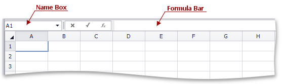

# Create a Simple Formula
The **Spreadsheet** allows you to perform calculations on data in cells using formulas. A formula is a string expression that starts with the equal sign ("="). Formulas can contain constants, math operators, functions, cell references, etc.

The **Spreadsheet** provides the capability to use the **Formula Bar**, which is the bar at the top of a worksheet, to enter and edit formulas.

For example, if you wish to add 1 to the product of 2 and 5, type the following formula in the cell in which you wish to insert the formula or in the **Formula Bar**.

**=2*5+1**

Press **ENTER**. The result appears in the cell in which you inserted the formula.