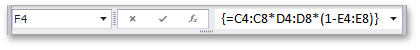
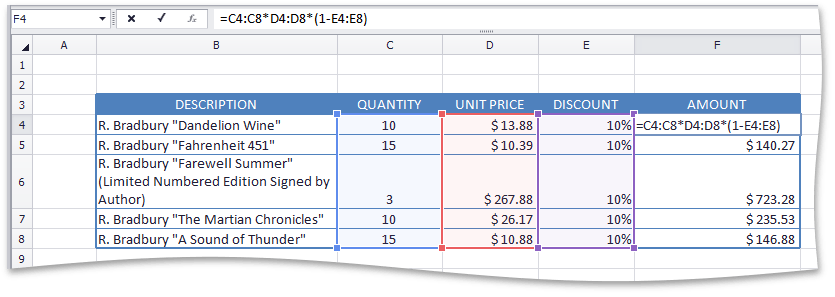

# Create an Array Formula
An **array formula** is a formula that performs calculations on sets of cell ranges, so that you do not need to re-enter formulas for each calculation. Create an array formula and specify the columns or rows that the array formula must fill. Array formulas are used to perform actions on two or more sets of values, which are called arguments. Each array argument must have the same number of rows and columns. The result of an array formula can either be a single value or multiple values.

To create an array formula, do the following.
1. Select the cell in which you wish to insert the array formula. If the formula calculates multiple results, select the cell range for which you wish to create the array formula.
2. Enter the array formula in the **Formula Bar**.
3. Press **CTRL+SHIFT+ENTER**. The **Spreadsheet** automatically adds a pair of curly braces to the formula to indicate that it is an array formula.
	
	

> [!NOTE]
> Any time you edit the array formula, you must press **CTRL+SHIFT+ENTER** to save changes and convert the formula into an array formula.

The example below demonstrates how to create a formula that multiplies three arrays of values (quantity, price and discount) to get an array of amount values for each product item without entering a separate formula for each row.

**=C4:C8*D4:D8*(1-E4:E8)**

