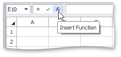
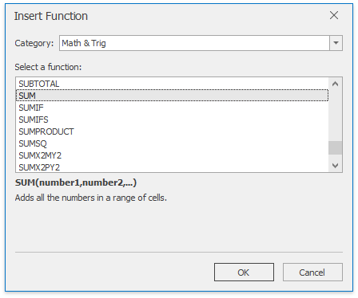
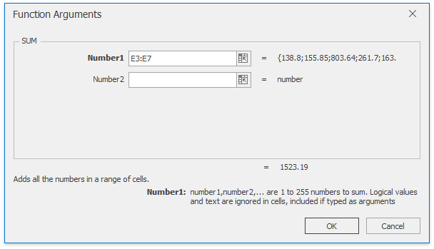

# Using Functions in Formulas
The **Spreadsheet** provides the capability to use a set of predefined **functions** in formulas to perform simple or complex calculations.

To create a formula containing functions, follow the instructions below.
1. Click the cell in which you want to insert the formula.
2. Type the equal sign "=". This is required to interpret the cell content as a formula. Skip this action if you insert the function in a cell which already contains a formula.
3. Type the function's name, or [insert the required function](#insertfunction) from the **Function Library**.
4. Enter the arguments between the function's parentheses.
5. Press **ENTER**. The result appears in the cell in which you inserted the formula.

## <a name="insertfunction"/>Insert a Function
If you do not remember the name of the function you want to use, you can insert the desired function quickly using one of the following approaches.
* **Using the Function Library group**
	
	On the **Formulas** tab, in the **Function Library** group, click the button corresponding to the category to which your function belongs, and select this function from the button's drop-down list.
	
	> [!TIP]
	> Frequently used functions such as **Sum**, **Average**, **Count Numbers**, **Max** and **Min** are also listed under the **AutoSum** button on the **Home** tab in the **Editing** group.
	
	For example, if you wish to add all numbers in the range **E4:E8**, in the **Function Library** group, select the **SUM** function from the **AutoSum** (or **Math &amp; Trig**) button's drop-down list. Type "E4:E8" in the function's parentheses, or select the cell range directly in the worksheet, and press **ENTER**.
	
	
* **Using the **Insert Function** dialog**
	1. To invoke the **Insert Function** dialog, click the **Insert Function** button on the **Formula Bar**, or press **SHIFT**+**F3**.
		
		
	2. At the top of the dialog, select a category to which the desired function belongs, and then select this function in the sorted list below. Note that at the bottom of the dialog, the selected function's syntax and description are shown. Click **OK**.
		
		
	3. In the invoked **Function Arguments** dialog, enter the required function's arguments (that are marked in bold font) in the corresponding editors. A function argument can be a data value, cell reference, defined name, another [function](#nestedfunction), etc.
		
		If your function uses a cell reference as an argument, you can select the desired cell range directly in the worksheet. To do this, click the **Collapse Dialog** button () to the right of the argument editor (to minimize the dialog and access the worksheet), select the appropriate cell range, and then click the **Expand Dialog** button () to restore the dialog's initial state and continue specifying other function arguments.
		
		
		
		After all the function's arguments are specified, click **OK** to finish building your formula and see the calculated result in the cell.

> [!NOTE]
> If you start the formula with a function, the **Spreadsheet** automatically adds the equal sign to your formula.

## <a name="nestedfunction"/>Nested functions
You can create a formula with a function that uses another function as one of the arguments. A function that is used as an argument is called a **nested function**. A formula can contain up to 64 levels of nesting.

Examples of formulas with nested functions are detailed in the table below.

| Formula | Description |
|---|---|
| **=ROUND(SUM(A1:A5),2)** | Round the sum of the values contained in the cell range **A1:A5** to two decimal places. |
| **=SQRT(AVERAGE(A1:A5))** | Returns the square root of the average value of the numbers in the cell range **A1:A5**. |
| **=IF(A5&lt;1000, POWER(A5,2))** | Square the value in cell **A5** if it is less than 1000. |