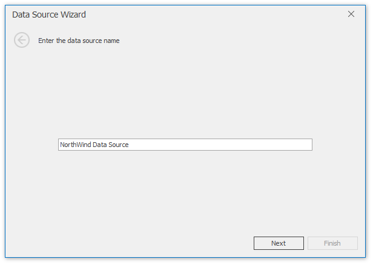
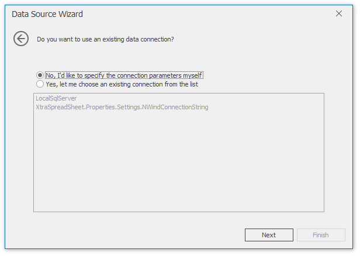
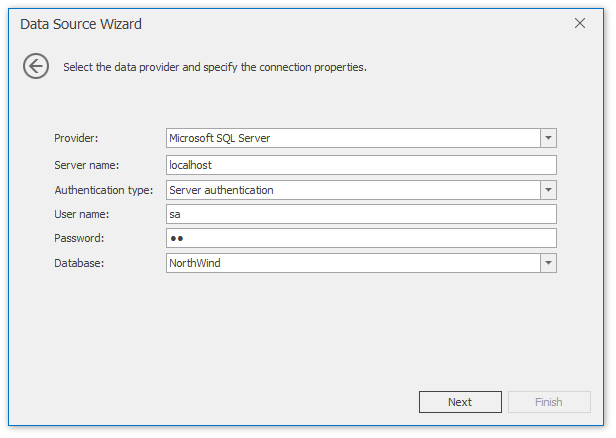
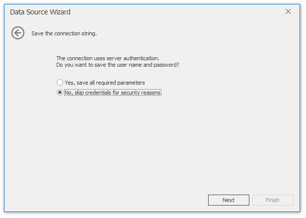
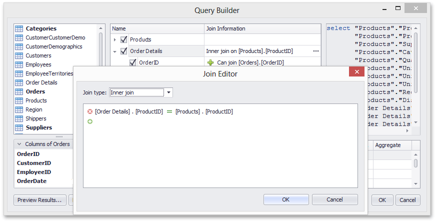
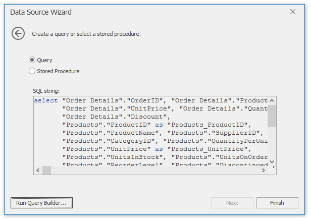
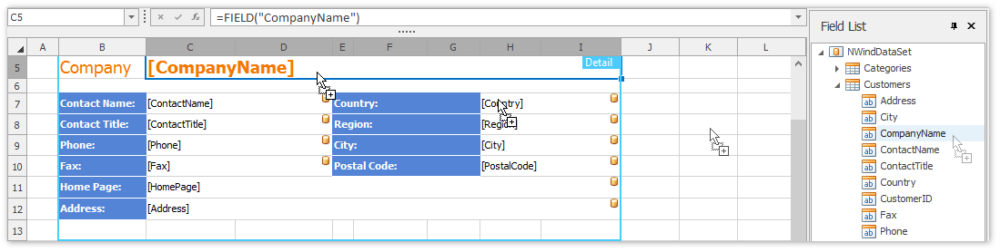

# Data Source Wizard
The **Data Source Wizard** allows the user to create a new data source, configure it, and if there is more than one data source available, to select the one that is required for a particular task. Once created, the data source configuration will be stored in the XLS/XLSX spreadsheet file, so the user does not have to re-configure the data source again.

To invoke the wizard, click **Add Data Source** in the **External Data Sources** group of the **Mail Merge** tab.

Next, proceed with the following steps in the wizard.
1. On the first page, specify the name for the new data source and click **Next**.
	
	
2. On the next page, select the data source type and click **Next**. The following steps assume that a **Database** is selected.
	
	
3. If a data connection has already been specified in the application, the next wizard page allows you to select whether to use one of the existing connections, or create a new one.
	
	
4. When creating a new connection, you can specify the connection parameters on the next page.
	
	
	
	On this page, you can define a custom connection string, or select from the following supported data source types.
	* Microsoft SQL Server
	* Microsoft Access 97
	* Microsoft Access 2007
	* Microsoft SQL Server CE
	* Oracle
	* Amazon Redshift
	* Google BigQuery
	* Teradata
	* Firebird
	* IBM DB2
	* MySQL
	* Pervasive PSQL
	* PostgreSQL
	* SAP Sybase Advantage
	* SAP Sybase ASE
	* SQLite
	* VistaDB
	* VistaDB5
	* XML File
	
	Depending on the selected data provider, it may be necessary to specify additional connection options (such as authentication type and database name) on this page.
	
	To proceed to the next wizard page, click **Next**.
5. On this page, you are prompted whether to save the user name and password in a connection string.
	
	
	
	Click **Next** to proceed to the next page.
6. This page allows you to select a query or a stored procedure.
	
	
	
	Click **Run Query Builder...** to invoke the **Query Builder** window.
7. The **Query Builder** window allows you to select tables and columns to include in the result. The joins are created automatically, however you can modify them using the **Join Editor**.
	
	
	
	Click **OK** to close the **Query Builder** dialog and return to the **Data Source Wizard**.
8. The data source is created and configured.
	
	
	
	Now you can click **Finish** to quit the **Data Source Wizard**.
	
	If the Spreadsheet is accompanied with the **Field List Panel**, the fields from the bound data source are immediately displayed within that panel. It allows you to drag and drop the required data field onto a worksheet used as a mail merge template.
	
	
	
	To modify the query used in the data source, click **Manage Relations -> Manage Queries** in the **External Data Sources** group to invoke the [Query Builder](query-builder.md).

> [!TIP]
> The data source configuration is stored in .xls or .xlsx file. You can save the workbook after creating the data source. Subsequently, you can start a mail merge immediately after the XLSX/XLS file is loaded into the Spreadsheet control.