# Mail Merge Overview
The **Spreadsheet** supports the **Mail Merge** functionality, which allows you to automatically generate a set of documents based on a common template, and include unique data values retrieved from a data source in each document. Use mail merge to generate personalized letters and a variety of professional reports.
* [Add a Data Source](#datasource)
* [Create a Template](#createtemplate)
* [Generate a Merged Document](#generatedocument)

## <a name="datasource"/>Add a Data Source
To perform a mail merge, you need a template and a data source from which the data is retrieved. You can specify a data source at runtime using the **Data Source Wizard**. Once created, the data source configuration will be stored in the XLS/XLSX spreadsheet file, so there is no need to re-configure the data source again.

To invoke the wizard, click **Add Data Source** in the **External Data Sources** group of the **Mail Merge** tab.

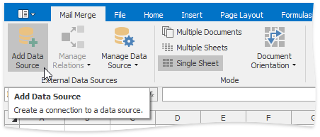

The wizard allows you to select the data source type. You can choose between an external database, the Entity Framework, an object data source or an Excel workbook.

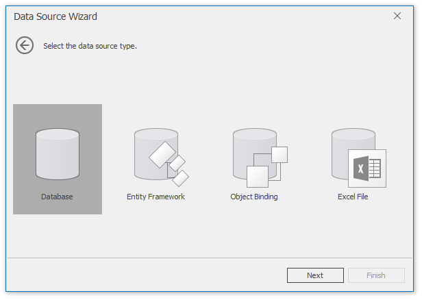

For more information on data source configuration, review the following documents:
* [Data Source Wizard](data-source-wizard.md)
* [Query Builder](query-builder.md)
* [Parameters Panel](parameters-panel.md)

## <a name="createtemplate"/>Create a Template
A template is a workbook with one worksheet containing **mail merge fields** that will be filled with unique data values from a bound data source.

As a rule, a template includes detail, header and footer ranges that reflect the structure of a merged document. To highlight template ranges, on the **Mail Merge** tab, in the **Design** group, click the **Mail Merge Design View** button.

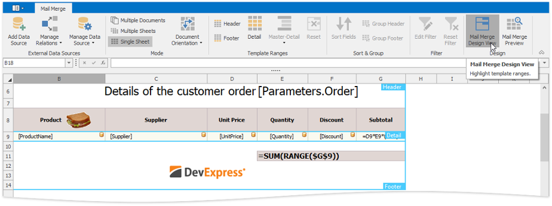

A **detail range** contains information from a data source. To create a detail range, select the range of the required size and do one of the following:
* On the **Mail Merge** tab, in the **Template Ranges** group, click the **Detail** button.
	
	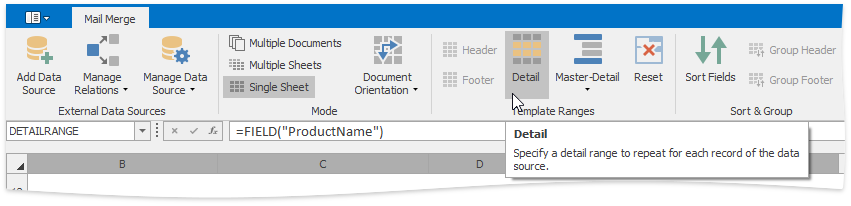
* Assign the "DETAILRANGE" defined name to the selected range.
	
	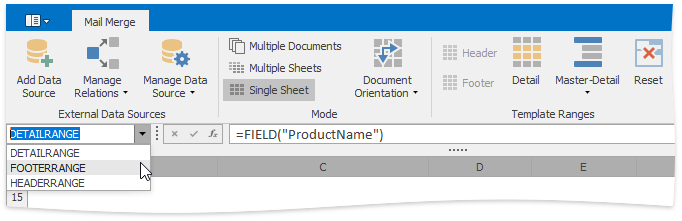

A detail range includes mail merge fields. Real data values retrieved from a data source will be displayed in a merged document instead of these fields. To create a mail merge field, use the **FIELD** function.

| Function | Syntax | Description |
|---|---|---|
| **FIELD** | FIELD("data_field_name") | Retrieves a data value from the corresponding field of a data source. |

A mail merge field is displayed as the name of the specified data field enclosed in square brackets. If a mail merge field is used in a cell formula as one of its elements, the entire formula is displayed in the cell.

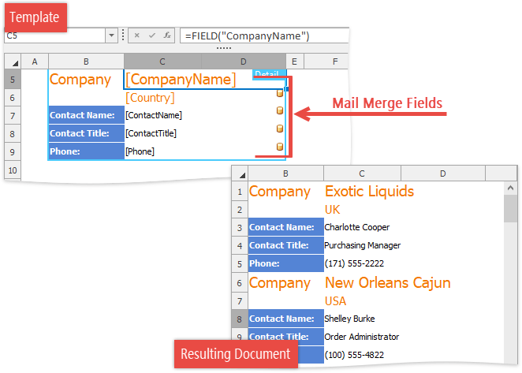

You can also create a multi-level report by adding nested levels within a detail range. To create the next data level, select a range within an existing detail range, and then click **Master-Detail** | **Detail Level** in the **Template Ranges** group. Click **Master-Detail** | **Data Member** to invoke the **Data Member** dialog and bind the specified detail level to a data member from a data source.

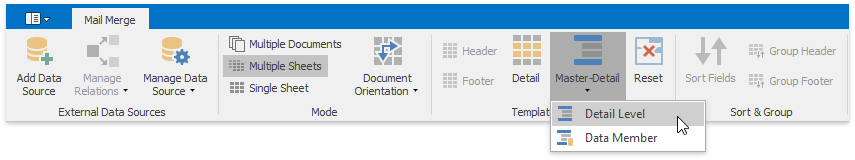

**Header** and **footer ranges** are displayed above and below all detail ranges in the resulting worksheet if all data records are merged into a single worksheet. In other [mail merge modes](#mergemodes), the header and footer are repeated for each detail range. To create a header or footer range, select the range you wish to use as a header or footer, and do one of the following:
* On the **Mail Merge** tab, in the **Template Ranges** group, click the **Header** or **Footer** button.
	
	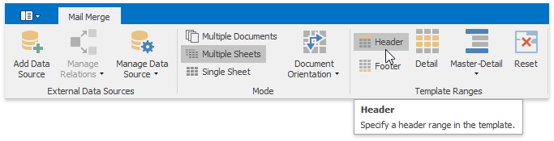
* Assign the "HEADERRANGE" or "FOOTERRANGE" defined name to the selected range.
	
	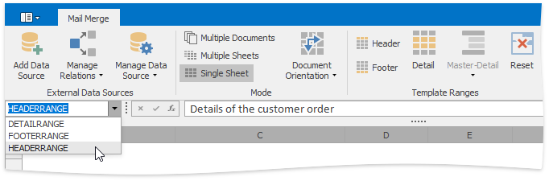

Note that you can create a header or footer range only if the template already contains a detail range. If you do not set a detail range, the entire template will be copied for each record of the data source.

At the template creation stage, you can access the range into which the specified cell in a template will be expanded after a mail merge is performed. To do this, use the **RANGE** function.

| Function | Syntax | Description |
|---|---|---|
| **RANGE** | RANGE(abs_cell_reference) | Obtains the specified range of a merged document. |

If you no longer wish to use the specified range as a detail range, header or footer, you can reset it by clicking the **Reset** button.

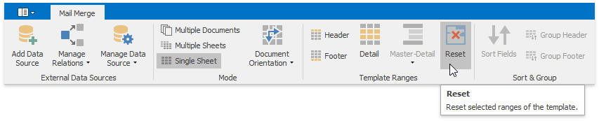

## <a name="generatedocument"/>Generate a Merged Document
<a name="mergemodes"/>

A mail merge supports three modes for generating a resulting document, as listed in the table below:

| Mode | Description |
|---|---|
| _Multiple Documents_ | Inserts the merged range for each record of the data source into a separate workbook. |
| _Multiple Sheets_ | Inserts the merged range for each record of the data source into a separate worksheet of a single document. |
| _Single Sheet_ | Inserts all merged ranges into a single worksheet, retaining the structure of the template document. |
| _Document Orientation_ | Specifies the direction in which the detail range will be repeated. |

To select the desired mode, on the **Mail Merge** tab, in the **Mode** group, click **Multiple Documents**, **Multiple Sheets** or **Single Sheet**. **Document Orientation** option can be useful for the **Single Sheet** mode only.

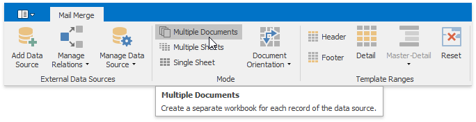