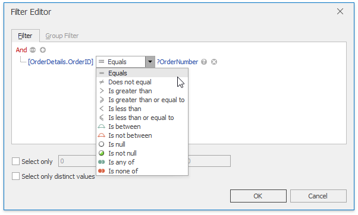
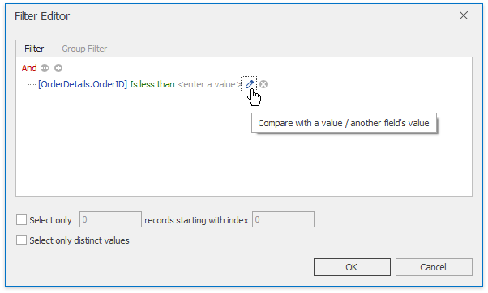

The Spreadsheet can be accompanied with the **Parameters** panel. It displays parameters used in a query to retrieve data and allows you to modify them. The following picture illustrates how to specify the order ID for data used in the mail merge template.

The resulting report for order ID 10300 is shown below.

To add a parameter to a query, invoke the [Query Builder](../../../../interface-elements-for-desktop/articles/spreadsheet/mail-merge/query-builder.md) and click the **Filter...** button to display the **Filter Editor** window.

The **Filter Editor** window allows you to specify a filtering criterion to be applied to the source data.

Click the icon on the right side of the **Filter Editor** to switch between a value, another field and a parameter.

Click **OK** to close the **Filter Editor** dialog and click **Next** in the **Query Editor** window to navigate to the page that allows you to configure query parameters. This page is shown in the image below.

Select the check box in the **Expression** column to specify an expression to calculate the parameter value. Map the query parameter to a new spreadsheet parameter. To do this, expand the drop-down list for the **Value** column and select the **New Spreadsheet Parameter...** item.

In the invoked **Spreadsheet Parameter** dialog, specify the required parameter settings (its name, type and initial value).

After closing the [Query Builder](../../../../interface-elements-for-desktop/articles/spreadsheet/mail-merge/query-builder.md) window, you will see the newly created parameter in the **Parameters** panel as shown in the picture at the beginning of this document.