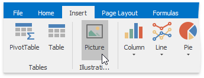
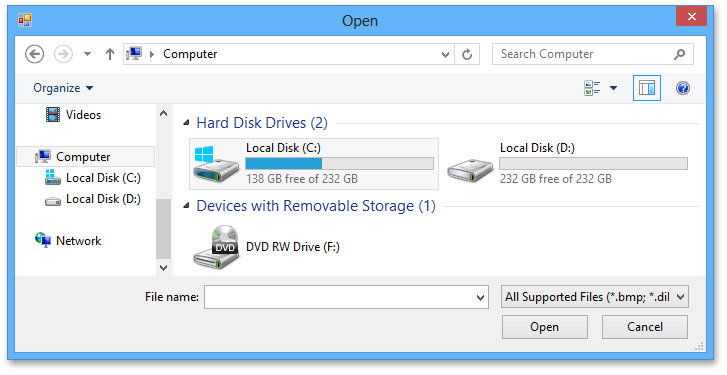

# Insert a Picture
The **Spreadsheet** allows you to insert pictures in a worksheet.

You can insert graphics of the following type.
* Bitmap (*.bmp, *.dib)
* JPEG File Interchange Format (*.jpg, *.jpeg)
* Portable Network Graphics (*.png)
* Graphics Interchange Format (*.gif)
* Tagged Image Format (*.tif, *.tiff)
* Microsoft Enhanced Metafile (*.emf)
* Windows  Metafile (*.wmf)

To insert a picture, follow the instructions below.
1. On the **Insert** tab, in the **Illustrations** group, click the **Picture** button.
	
	
2. In the **Open** dialog box that is invoked, locate the folder that contains the picture you want to insert. Click **Open**. The picture will be inserted into the worksheet.
	
	