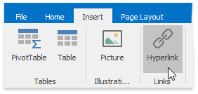

# Insert and Delete Hyperlinks
The **Spreadsheet** allows you to [insert](#inserthyperlink), edit and [delete](#deletehyperlink) hyperlinks. A hyperlink is a link from a worksheet to another file or Web page that can be opened when you click the hyperlink text or image.

## <a name="inserthyperlink"/>Insert a Hyperlink
1. Click the cell in which you wish to insert a hyperlink.
2. Do one of the following.
	* In the **Links** group within the **Insert** tab, click the **Hyperlink** button.
		
		
	* Right-click the cell and select **Hyperlink...** from the context menu.
		
		
	* Press **CTRL+K**.
3. In the invoked **Edit Hyperlink** dialog box, select whether you wish to insert a hyperlink to an existing file, a Web page, a location within the current workbook, or an email address. Depending on your choice, provide all required options in the right pane of the dialog box.
	
	

## <a name="deletehyperlink"/>Delete a Hyperlink
1. To delete a hyperlink along with its text, do one of the following.
	* In the **Editing** group within the **Home** tab, click the **Clear** button, and select **Clear Contents** from the drop-down list.
		
		
	* Right-click the cell that contains the hyperlink and select **Clear Contents** from the invoked context menu.
2. To delete a hyperlink while maintaining its text with hyperlink formatting, in the **Editing** group within the **Home** tab, click **Clear**, and select **Clear Hyperlinks** from the drop-down list.
	
	
3. To delete a hyperlink while maintaining its text with default formatting, do one of the following.
	* In the **Editing** group within the **Home** tab, click the **Clear** button, and select **Remove Hyperlinks** from the drop-down list.
		
		
	* Right-click the cell that contains the hyperlink and select **Remove Hyperlinks** from the invoked context menu.