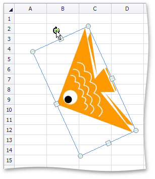
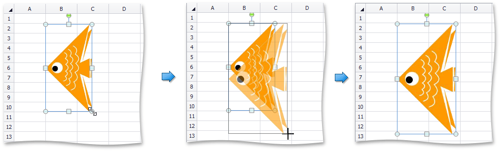

# Move, Rotate and Resize a Picture
## Move a Picture
1. Click the picture you wish to move.
2. Drag the picture to a new location.

## Rotate a Picture
1. Click the picture you wish to rotate.
2. Click the _rotation handle_ (the round arrow that appears over the selected picture) and drag it in the direction in which you wish to rotate the object.
	
	
3. To rotate a picture in 15-degree increments, drag the rotation handle while holding down the **SHIFT** key.

## Resize a Picture
1. Click the picture to be resized.
2. Drag the _sizing handle_ away from the center (or towards the center) of the picture, and release it once the desired size is reached.
	
	

When you change the width of the object by dragging a _corner sizing handle_, the object's height will automatically be changed to maintain the aspect ratio of the object, and vice-versa.