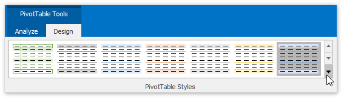
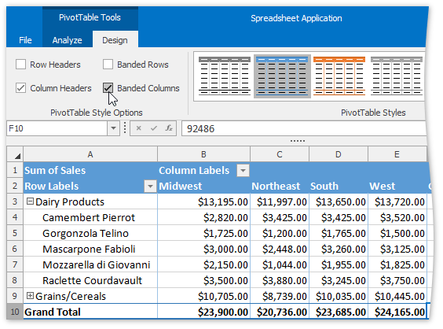

# Apply a Predefined Style to a Pivot Table
You can change the appearance of a pivot table using one of the predefined pivot table styles. Select the desired style from the **PivotTable Styles** gallery on the **PivotTable Tools** | **Design** tab and it will be automatically applied to the report.

Additionally, you can specify whether to apply style formatting to the row and column headers or to show the banded rows and columns. To do that, on the **PivotTable Tools** | **Design** tab, in the **PivotTable Style Options** group, select or clear the corresponding check box.

