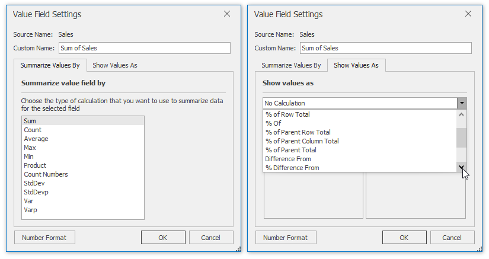
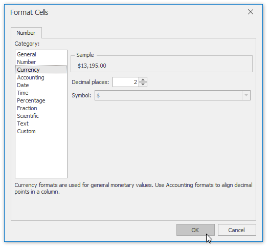
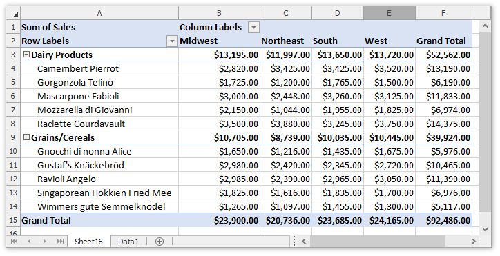

# Change the Value Field Settings
By default, when you add a numeric field to the Values area, its data is summarized by the _Sum_ function. For a text field or field containing blank cells, the _Count_ function is used as the default summary function.

However, you can change how summary values are calculated and displayed within the PivotTable report. To do this, follow the steps below.
1. Select any cell in the value field you wish to modify. On the **PivotTable Tools** | **Analyze** tab, in the **Active Field** group, click the **Field Settings** button.
	
	
2. The invoked **Value Field Settings** dialog allows you to provide the custom name for the value field and change the aggregate function used to summarize its values. On the **Show Values As** tab, you can configure how calculation results should be displayed in cells.
	
	
3. To change the default number format applied to the value field, click the **Number Format** button. In the invoked **Format Cells** dialog, select the desired format type, specify the corresponding settings and click **OK**.
	
	
4. The result is shown in the image below.
	
	