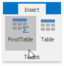
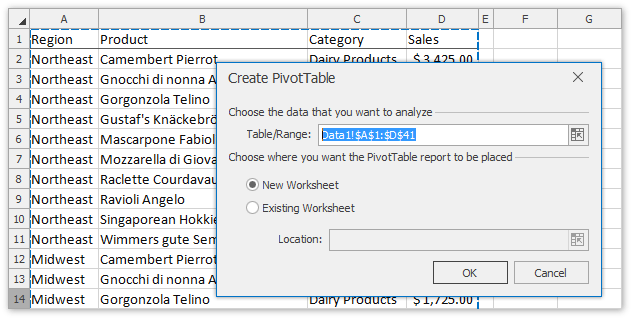
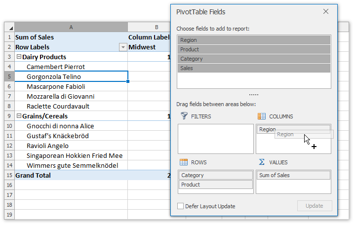
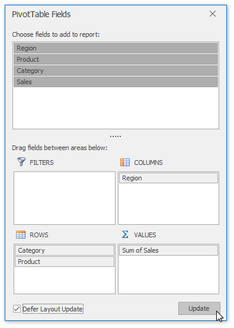

# Create a Pivot Table
A **pivot table** represents a summary table used to explore, analyze and aggregate large amounts of data in a worksheet. It helps divide your data into categories and subcategories, and automatically calculates subtotals and grand totals using the most suitable summary function from a predefined list.

To create a PivotTable report, follow the steps below.
1. On the **Insert** tab, in the **Tables** group, click the **PivotTable** button.
	
	
2. In the invoked **Create PivotTable** dialog, specify the source data and the location of the new pivot table, and click **OK**. 
	
	> [!IMPORTANT]
	> Before creating a pivot table, make sure that the source data is organized in a tabular format, has column headings in the first row and does not include blank rows or columns.
	
	
3. An empty report is created and the **Field List** pane is invoked.
	
	
4. To fill the pivot table with data, select the desired field in the **Field List** pane and drop it to the one of the following areas at the pane bottom.
	* **Rows Area** - contains fields used to group report data by rows.
	* **Columns Area** - contains fields used to break report data into categories by columns.
	* **Values Area** - contains fields against which summaries are calculated. As a rule, value fields contain numeric values, which are summarized with the Sum function, but you can [change the calculation type](change-the-value-field-settings.md) by selecting one of the predefined functions (Count, Average, Min, Max, Product, Count Numbers, StdDev, StdDevp, Var, or Varp).
	* **Filters Area** - contains fields used to filter the entire PivotTable report to display data for the selected items.
	
	All the changes are automatically reflected in the report.
	
	
5. To postpone the report update, select the **Defer Layout Update** check box at the bottom of the pane. The table will be updated only after clicking the **Update** button.
	
	
6. To clear the PivotTable report, on the **PivotTable Tools** | **Analyze** tab, in the **Actions** group, click the **Clear PivotTable** button and select the **Clear All** item from the drop-down list.
	
	
7. To remove the pivot table completely, select the entire PivotTable range and press **DELETE**.