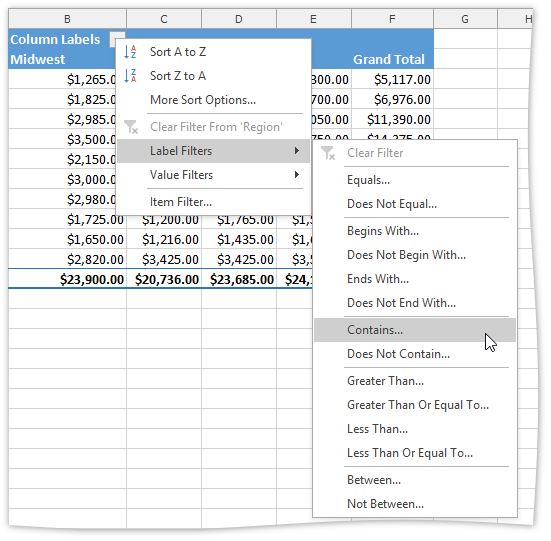
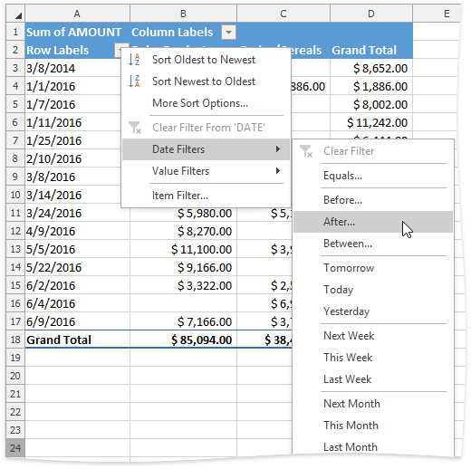
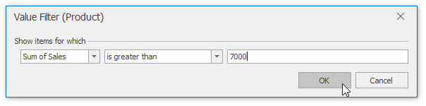

The **Spreadsheet** provides numerous ways to apply filtering to the PivotTable fields to display only data that meets specific criteria. Select the task you wish to perform.
* [Use a Report Filter](#page)
* [Filter Row or Column Items](#item)
* [Use a Label Filter](#labels)
* [Use a Date Filter](#date)
* [Use a Value Filter](#values)
* [Use Multiple Filters per Field](#multiple)
* [Remove a Filter](#remove)

<a name="page"/>

## Use a Report Filter
A report filter allows you to filter the entire PivotTable report to show data for specific items. To use a report filter, follow the steps below.
1. Click the arrow  in the report filter field.
	
	
2. In the invoked dialog, click the **Uncheck All** button to deselect the values. Then, select the check box for the item you wish to display. To select multiple items, select the **Select Multiple Items** check box at the pane bottom. Click **OK** to apply changes.
	
	
3. The resulting report is shown in the image below. The **Filter** button  appears in the report filter field to indicate that the filter is applied. 
	
	

<a name="item"/>

## Filter Row or Column Items
1. Click the arrow  in the **Row Labels** or **Column Labels** cell. If there are multiple fields in the area, select the row or column field you wish to filter.
2. In the drop-down menu, select **Item Filter...**
	
	
3. In the invoked dialog, click the **Uncheck All** button to deselect the values. Then, select the item(s) you wish to display and click **OK**. 
	
	
4. The resulting report is shown in the image below. The **Filter** button  appears in the row or column label to indicate that the filter is applied. 
	
	

<a name="labels"/>

## Use a Label Filter
1. Click the arrow  in the **Row Labels** or **Column Labels** cell. If there are multiple fields in the area, select the row or column field you wish to filter.
2. Point to the **Label Filters** item and select one of the built-in comparison operators. 
	
	
3. In the invoked dialog, specify the filter criteria and click **OK**. 
	
	
4. The resulting report is shown in the image below. The **Filter** button  appears in the row or column label to indicate that the filter is applied.
	
	

<a name="date"/>

## Use a Date Filter
1. Click the arrow  in the header of the row or column field containing dates.
2. Point to the **Date Filters** item and select one of the built-in dynamic filter types to display dates that fall within a specified time period (next, this or last week, month, year, etc.) or select the **Before**, **After**, **Equals** or **Between** item to find dates that are before, after or equal to the specified date, or between two dates. 
	
	
3. In the invoked **Date Filter** dialog, specify the date(s) to filter by and click **OK**.
	
	
4. The resulting report is shown in the image below. The **Filter** button  appears in the row or column label to indicate that the filter is applied.
	
	

<a name="values"/>

## Use a Value Filter
A value filter allows you to filter items in a row or column field based on summary values. To use a value filter, follow the steps below.
1. Click the arrow  in the **Row Labels** or **Column Labels** cell. If there are multiple fields in the area, select the row or column field to which a filter should be applied.
2. Point to the **Value Filters** item and select one of the built-in comparison operators. 
	
	
3. In the invoked dialog, specify the filter criteria and click **OK**. Note that the filtering will be applied to the filtered field's **Grand Total** values. 
	
	
4. The resulting report is shown in the image below. The **Filter** button  appears in the row or column label to indicate that the filter is applied. 
	
	

<a name="multiple"/>

## Use Multiple Filters per Field
To enable the capability to apply multiple filters to a single row or column field, do the following.
* On the **PivotTable Tools** | **Analyze** tab, in the **PivotTable** group, click the **PivotTable Options** button.
	
	
* In the invoked **PivotTable Options** dialog, switch to the **Totals &#38; Filters** tab and check the **Allow multiple filters per field** box.
	
	

<a name="remove"/>

## Remove a Filter
To remove a filter, do the following.
* To remove a filter from a specific field, click the **Filter** button  and select the **Clear Filter From 'Field Name'**  item in the drop-down menu. 
	
	
* To clear all filters applied to the PivotTable fields at once, on the **PivotTable Tools** | **Analyze** tab, in the **Actions** group, click **Clear PivotTable** | **Clear Filters**. 
	
	