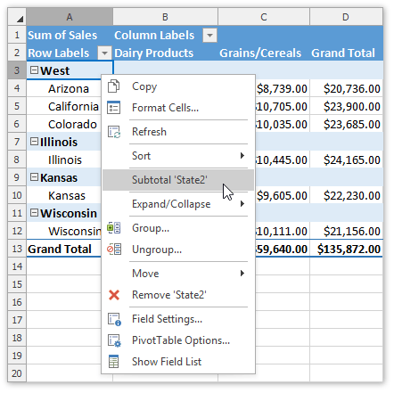

Grouping can help you get a clearer view of data and show only data you want to analyze. The following topic describes how to group [dates](#date), [numbers](#number) or [selected items](#text) in a pivot table.

<a name="date"/>

## Group a Pivot Table by Date
1. Right-click a cell within a row or column field containing dates and select **Group...**
	
	
	
	...or on the **PivotTable Tools** | **Analyze** tab, in the **Group** group, click the **Group Field** button.
	
	
2. The **Grouping** dialog is invoked. Type the first and last date or time you want to group by, select one or more date or time intervals for grouping and click **OK**.
	
	
3. As a result, the date field will be grouped as shown in the image below.
	
	

<a name="number"/>

## Group a Pivot Table by Numbers
1. Right-click a cell within a row or column field containing numeric values and select **Group...**
	
	
	
	...or on the **PivotTable Tools** | **Analyze** tab, in the **Group** group, click the **Group Field** button.
	
	
2. The **Grouping** dialog is invoked. Type in start value, end value, interval and click **OK**.
	
	
3. The result is shown in the image below.
	
	

<a name="text"/>

## Group Selected Items
1. Select the items that you want to group.
2. Right-click the selected range and select the **Group** item from the context menu...
	
	
	
	...or on the **PivotTable Tools** | **Analyze** tab, in the **Group** group, click the **Group Selection** button.
	
	
3. As a result, the selected range will be combined into a single group. To rename the group, select the group header, press **F2** and type the required name.
	
	
4. You can also enable or disable displaying the subtotal for the created group. To do that, right-click the group header and select the **Subtotal 'Field Name'** item.
	
	
5. The resulting report is shown in the image below.
	
	

## Ungroup Data
To ungroup data in a pivot table, do one of the following.
* Right-click the grouped field and select **Ungroup...** from the context menu.
	 
	
	
* Select any cell in the grouped field and on the **Pivot Table Tools** | **Analyze** tab, in the **Group** group, click the **Ungroup** button.
	
	
	
Note that ungrouping a numeric or date and time field will remove all groups for that field. If you ungroup a group of selected items, only the selected items will be ungrouped.
