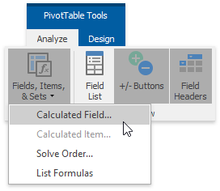
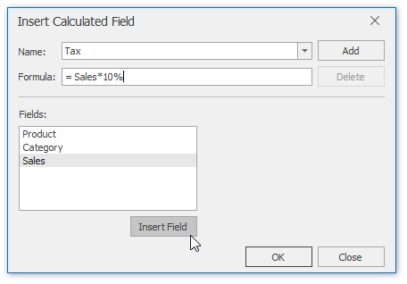
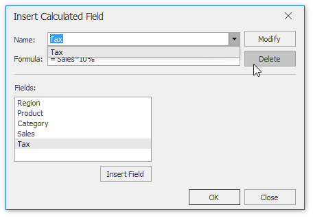
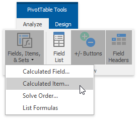
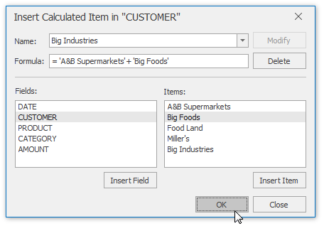
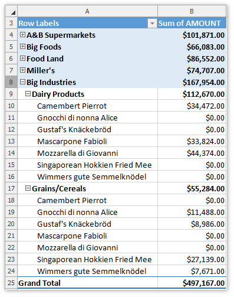
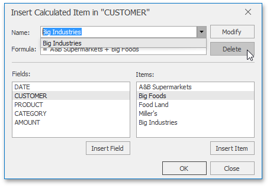
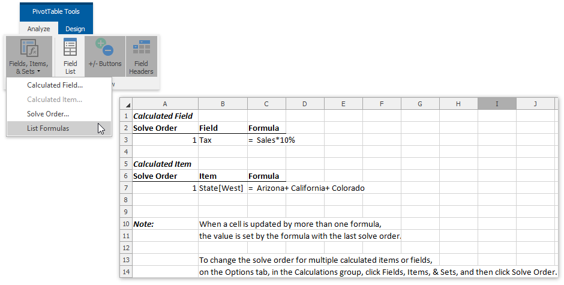

# Insert a Calculated Field and Calculated Item
If the predefined aggregation functions or the **Show Values As** calculation options do not meet your requirements, you can create your own formulas to calculate values in a PivotTable report by inserting [calculated fields](#calculatedfield) and [calculated items](#calculateditem).

<a name="calculatedfield"/>

## Insert a Calculated Field
**Calculated fields** can perform calculations using the contents of other fields in the report. A calculated field's formula should conform to the common syntax rules and contain only supported elements.
* In the formula, you can use constants and refer to other fields in the pivot table. The calculation will be performed on the sum of the underlying data for any fields in the formula. When you reference a field in your formula, you can enclose its name in apostrophes or omit them.
* You cannot create formulas that use a cell reference, defined name, circular references and arrays.
* The formula cannot refer to the PivotTable’s subtotals, totals and Grand Total value.

To insert a calculated field, do the following.
1. Select a cell within the PivotTable report and on **PivotTable Tools** | **Analyze** tab, in the **Calculation** group, click the **Fields, Items, &amp; Sets** button. In the drop-down menu, select the **Calculated Field...** item to invoke the **Insert Calculated Field** dialog. 
	
	
2. In the dialog window, specify the name and formula for the calculated field. To use data from another field in the formula, click the required field in the **Fields** box, and then click **Insert Field**. 
	
	
3. Click **Add**, and then click **OK**. As a result, the new field will be automatically added to the **Values** area of the PivotTable report. 
	
	
4. To delete a calculated field, invoke the **Insert Calculated Field** dialog, select the required field from the **Name** drop-down list and click **Delete**. 
	
	

<a name="calculateditem"/>

## Insert a Calculated Item
A **calculated item** is a custom item in a PivotTable field whose value is produced based on values of other items in the same field. Before inserting a calculated item, take into account the following restrictions.
* You cannot add a calculated item to a page field. Also, you cannot move a row or column field containing calculated items to the page area of the PivotTable report.
* You cannot add a calculated item to a grouped field. Ungroup the field before inserting the calculated item.
* You cannot add multiple copies of a field containing calculated items to the data area.
* You cannot add a calculated item to a PivotTable report that uses the **Average**, **StdDev**, **StdDevp**, **Var** or **Varp** aggregation function in the data area.

To insert a calculated item, follow the steps below.
1. Select a cell in the field to which the calculated item should be added. On the **PivotTable Tools** | **Analyze** tab, in the **Calculations** group, click the **Fields, Items, &amp; Sets** item and select the **Calculated Item...** item from the drop-down menu.
	
	
2. In the invoked **Insert Calculated Item** dialog, specify the name and formula for the calculated item. To use a value of another item in the formula, click the required item in the **Items** list, and then click **Insert Item**. Note that you can use only items from the same field as the calculated item.
	
	
3. Click **Add**, and then click **OK**. As a result, the new item will be added to the field. 
	
	
4. To delete a calculated item, invoke the **Insert Calculated Item** dialog, select the required item from the **Name** drop-down list and click **Delete**. 
	
	

## Create a List of the PivotTable Formulas
You can automatically create a list of all the calculated fields and items used in the current pivot table. To do that, on the **PivotTable Tools** | **Analyze** tab, in the **Calculations** group, click the **Fields, Items, &amp; Sets** item and select the **List Formulas** item from the drop-down menu. As a result, the list will be created on a new worksheet and will appear as in the image below. 

