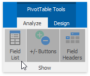
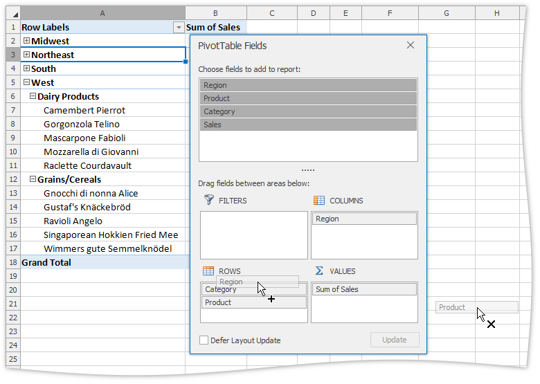
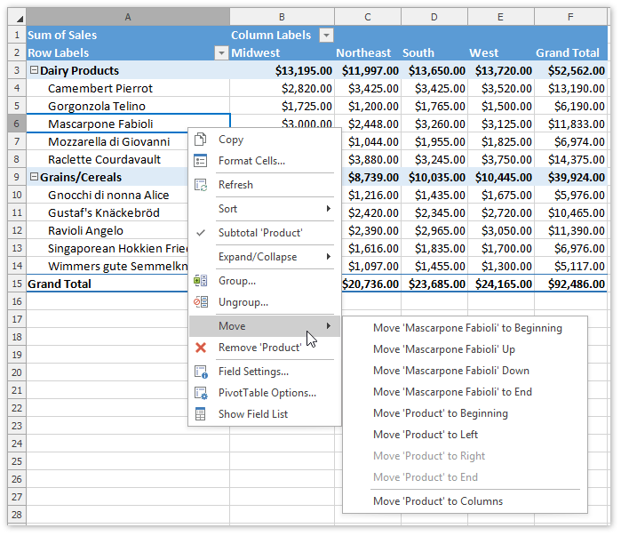
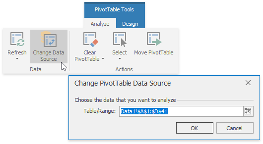
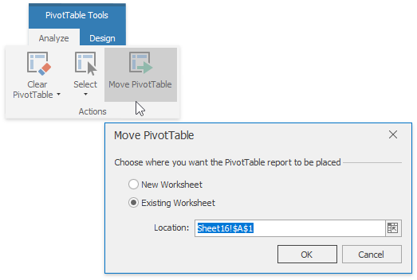

# Modify a Pivot Table
The following topic describes how to modify the existing pivot table. Select the task you wish to perform.
* [Rearrange the PivotTable Fields](#rearrange)
* [Change the PivotTable Data Source](#datasource)
* [Move the Pivot Table](#move)

<a name="rearrange"/>

## Rearrange the PivotTable Fields
To reorganize the pivot table structure, use the **Field List** pane. It invokes automatically when you select any cell in the report. 

If you closed the pane, you can re-invoke it from the ribbon menu. To do that, on the **PivotTable Tools** | **Analyze** tab, in the **Show** group, click the **Field List** button.

In the **Field List** pane, you can rearrange fields within the report by dragging them between the area sections at the bottom of the pane. To remove the field from the report, drag it outside the pane. All changes will be applied immediately.

Additionally, you can reorder fields or specific field items within the area. To do that, right-click the required cell in the report and select the appropriate **Move** command from the context menu.

<a name="datasource"/>

## Change the PivotTable Data Source
To change the data source of the pivot table report, on the **PivotTable Tools** | **Analyze** tab, in the **Data** group, click the **Change Data Source** button. 

The invoked dialog allows you to select the new source range for the pivot table.

<a name="move"/>

## Move the PivotTable
To move the entire report, on the **PivotTable Tools** | **Analyze** tab, in the **Actions** group, click the **Move PivotTable** button. The invoked dialog allows you to move the report to another cell range within the existing worksheet or to a new worksheet.

