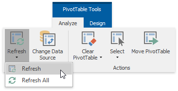
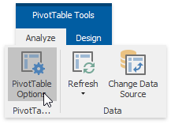
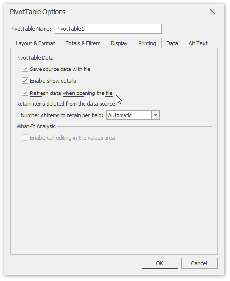
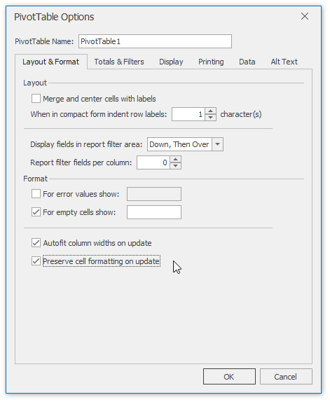

# Refresh the PivotTable Data
You can update (refresh) the PivotTable data manually (while generating the report) or automatically (when you open the workbook with the pivot table). The steps below provide more detailed information about how to accomplish these tasks.
1. To update the pivot table manually, on the **PivotTable Tools** | **Analyze** tab, in the **Data** group, click **Refresh** and select the **Refresh** item from the invoked drop-down menu. To update all pivot tables of the current workbook, select **Refresh All**.
	
	
2. To refresh the pivot table when opening the file, use the **PivotTable Options** dialog. To invoke it, on the **PivotTable Tools** | **Analyze** tab, in the **PivotTable** group, click **PivotTable Options**.
	
	
3. Switch to the **Data** tab. In the **PivotTable Data** section, select the **Refresh data when opening the file** check box.
	
	
4. To preserve the PivotTable display and formatting settings during the update operation, switch to the dialog's **Layout &amp; Format** tab. Here you can specify whether to auto-fit the column widths or preserve cell formatting when updating the report. To do that, select the required options in the last section of the dialog.
	
	