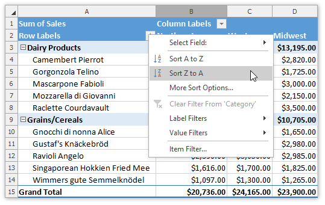
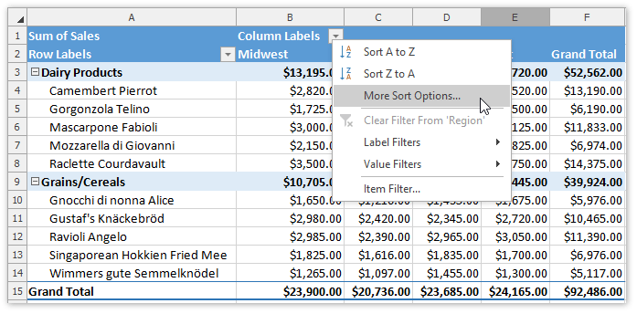
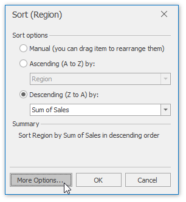
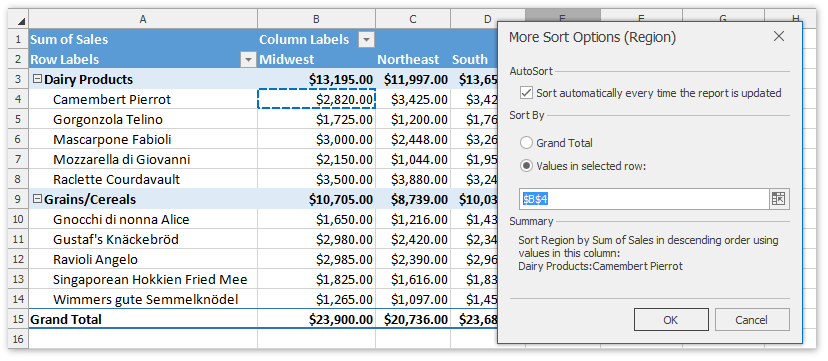
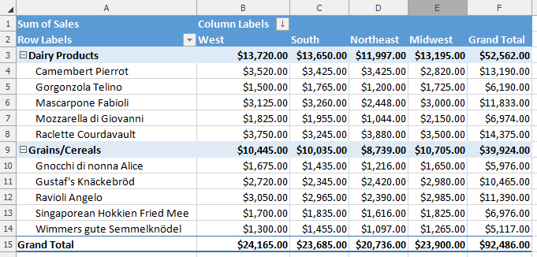

# Sort Items in a Pivot Table
The following topic describes how to sort items in the PivotTable fields by [labels](#labels) and [summary values](#values).

<a name="labels"/>

## Sort Item Labels
Item labels in a PivotTable field can be sorted by text (**A to Z** or **Z to A**), numbers (**smallest to largest** or **largest to smallest**), or dates and times (**oldest to newest** or **newest to oldest**). To apply sorting, do the following.
1. Click the arrow  in the **Row Labels** or **Column Labels** cell. If there are multiple fields in the area, select the row or column field you wish to sort.
2. In the invoked drop-down list, select the **Sort A to Z** item to use ascending order, or click **Sort Z to A** to sort in descending order. As a result, items in the filtered field will be reordered correspondingly. The tiny arrow  appears in the row or column label to indicate that data in the report is sorted.
	
	

<a name="values"/>

## Sort Items By Summary Values
Besides sorting item labels, you can also sort items in a row or column field based on data in the **Values** area of the PivotTable report. To do this, follow the steps below.
1. Click the arrow  in the **Row Labels** or **Column Labels** cell. In the invoked drop-down list, select the row or column field you wish to sort (if there are multiple fields in the area), and then click the **More Sort Options...** item.
	
	
2. In the invoked dialog box, select the desired sort order and the value field to sort by. Click the **More Options...** button. 
	
	
3. In the **More Sort Options** dialog, click **Grand Total** or select a row/column in the **Values** area to sort by and click **OK**. 
	
	
4. The result is shown in the image below. The tiny arrow  appears in the row or column label to indicate that data in the corresponding field is sorted.
	
	