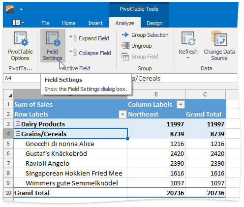
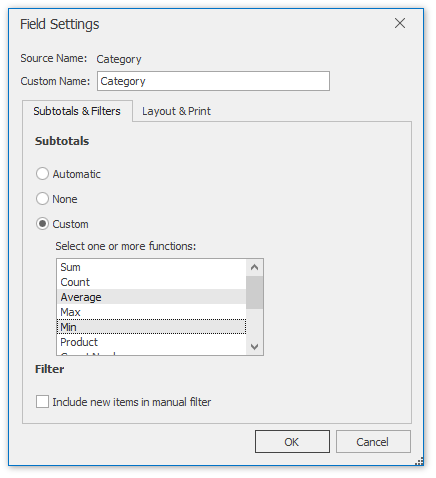
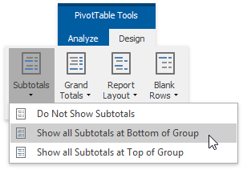
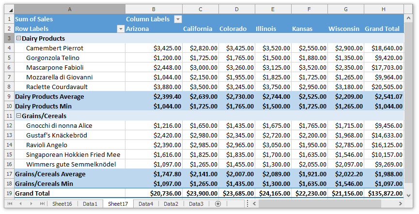
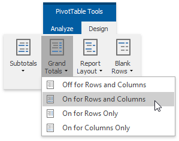
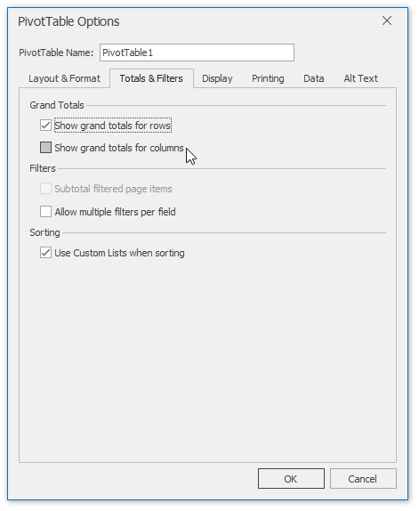

# Subtotal and Total Fields in a Pivot Table
The following topic describes how to manage the [subtotals](#subtotals) and [grand totals](#grandtotals) in a pivot table.

<a name="subtotals"/>

## Subtotal Row and Column Fields
1. Click the target row or column field within the report and on the **PivotTable Tools** | **Analyze** tab, in the **Active Field** group, click the **Field Settings** button.
	
	
2. On the **Subtotals &amp; Filters** tab of the invoked **Field Settings** dialog, select one of the following options and click **OK** to apply changes.
	* **Automatic** - to calculate the subtotals using the default summary function.
	* **Custom** - to use one or multiple custom functions for subtotal calculation. Note that if the target row or column field contains calculated items, the custom function(s) cannot be used.
	* **None** - to remove subtotals.
	
	
3. To specify the subtotal display settings, on the **PivotTable Tools** | **Design** tab, in the **Layout** group, click the **Subtotals** button. The invoked drop-down menu allows you to display the subtotals at the top or bottom of each item in the outer row fields in compact or outline form, or hide subtotals.
	
	
4. As a result, the pivot table will appear as follows.
	
	

<a name="grandtotals"/>

## Show or Hide Grand Totals
1. To show or hide the grand totals for a pivot table, on the **PivotTable Tools** | **Design** tab, in the **Layout** group, click **Grand Totals**. In the invoked drop-down menu, select one of the available options. You can hide/show the grand totals for the entire report or for the rows or columns only.
	
	
2. To specify the default settings for displaying grand totals, use the **PivotTable Options** dialog. To invoke it, on the **PivotTable Tools** | **Analyze** tab, in the **PivotTable** group, click the **PivotTable Options** button.
	
	
3. Switch to the **Totals &amp; Filters** tab. To show or hide the grand totals for rows, columns or the entire PivotTable report, select or clear the corresponding check box(es) in the **Grand Totals** section.
	
	