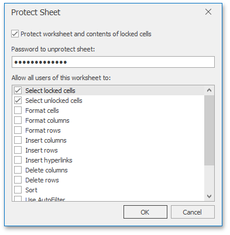
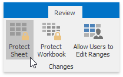

# Protect a Worksheet
Worksheet protection locks the cells so that you can only perform a specific (restricted) set of actions.

By default, all cells in the worksheet are locked. When protection is applied to the worksheet, these cells become read-only. However, you can specify certain actions which can be performed with the locked cells in a protected worksheet.

To protect a worksheet, use the following dialog:

To invoke this dialog, on the **Review** tab, in the **Changes** group, click the **Protect Sheet** button.

In a protected sheet, this button displays the "**Unprotect Sheet**" caption, which invokes a simple dialog that prompts for a password or unlocks the sheet if an empty password was set.