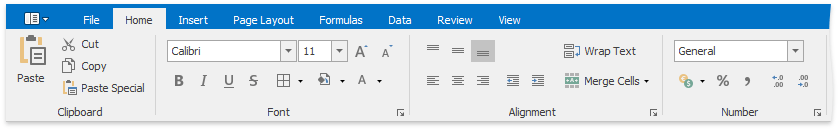
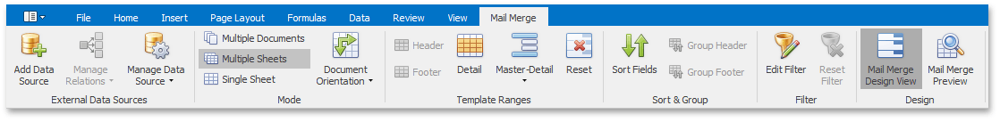

# Ribbon Interface
The comprehensive functionality of the **Spreadsheet** is provided by a set of **Ribbon** pages. Ribbon pages are divided into logical groups that include commands with common features. Use the **Ribbon** interface to perform basic operations in the **Spreadsheet** ([load](../../../../interface-elements-for-desktop/articles/spreadsheet/file-operations/load-a-workbook.md), [create](../../../../interface-elements-for-desktop/articles/spreadsheet/file-operations/create-a-workbook.md) and [save](../../../../interface-elements-for-desktop/articles/spreadsheet/file-operations/save-a-workbook.md) workbooks, [add](../../../../interface-elements-for-desktop/articles/spreadsheet/file-operations/create-a-worksheet.md) or [remove](../../../../interface-elements-for-desktop/articles/spreadsheet/file-operations/delete-a-worksheet.md) worksheets, [format cells](../../../../interface-elements-for-desktop/articles/spreadsheet/cell-formatting/format-cells.md), [insert rows](../../../../interface-elements-for-desktop/articles/spreadsheet/columns-and-rows/insert-and-delete-columns-and-rows.md) and [columns](../../../../interface-elements-for-desktop/articles/spreadsheet/columns-and-rows/insert-and-delete-columns-and-rows.md), etc.).

## File Tab

* [Create a Workbook](../../../../interface-elements-for-desktop/articles/spreadsheet/file-operations/create-a-workbook.md)
* [Load a Workbook](../../../../interface-elements-for-desktop/articles/spreadsheet/file-operations/load-a-workbook.md)
* [Save a Workbook](../../../../interface-elements-for-desktop/articles/spreadsheet/file-operations/save-a-workbook.md)
* [Print a Workbook](../../../../interface-elements-for-desktop/articles/spreadsheet/file-operations/print-a-workbook.md)
* [Undo and Redo Last Actions](../../../../interface-elements-for-desktop/articles/spreadsheet/file-operations/undo-and-redo-last-actions.md)
* [Encrypt a Workbook with the Password](../../../../interface-elements-for-desktop/articles/spreadsheet/protection/encrypt-a-workbook-with-the-password.md)

## Home Tab

* [Copy and Paste Cell Content](../../../../interface-elements-for-desktop/articles/spreadsheet/editing-cells/copy-and-paste-cell-content.md)
* [Format Cells](../../../../interface-elements-for-desktop/articles/spreadsheet/cell-formatting/format-cells.md)
* [Format Cell Content](../../../../interface-elements-for-desktop/articles/spreadsheet/cell-formatting/format-cell-content.md)
* [Wrap Text and Merge Cells](../../../../interface-elements-for-desktop/articles/spreadsheet/cell-formatting/wrap-text-and-merge-cells.md)
* [Number Formatting](../../../../interface-elements-for-desktop/articles/spreadsheet/cell-formatting/number-formatting.md)
* [Conditional Formatting ](../../../../interface-elements-for-desktop/articles/spreadsheet/cell-formatting/conditional-formatting.md)
* [Clear Cell Formatting](../../../../interface-elements-for-desktop/articles/spreadsheet/cell-formatting/clear-cell-formatting.md)
* [Insert and Delete Columns and Rows](../../../../interface-elements-for-desktop/articles/spreadsheet/columns-and-rows/insert-and-delete-columns-and-rows.md)
* [Show and Hide Columns and Rows](../../../../interface-elements-for-desktop/articles/spreadsheet/columns-and-rows/show-and-hide-columns-and-rows.md)
* [Specify Column Width and Row Height](../../../../interface-elements-for-desktop/articles/spreadsheet/columns-and-rows/specify-column-width-and-row-height.md)
* [Fill Data Automatically](../../../../interface-elements-for-desktop/articles/spreadsheet/editing-cells/fill-data-automatically.md)
* [Find and Replace](../../../../interface-elements-for-desktop/articles/spreadsheet/editing-cells/find-and-replace.md)

## Insert Tab

* [Create a Pivot Table](../../../../interface-elements-for-desktop/articles/spreadsheet/pivot-tables/create-a-pivot-table.md)
* [Create a Table ](../../../../interface-elements-for-desktop/articles/spreadsheet/tables/create-a-table.md)
* [Insert a Picture](../../../../interface-elements-for-desktop/articles/spreadsheet/pictures-and-hyperlinks/insert-a-picture.md)
* [Move, Rotate and Resize a Picture](../../../../interface-elements-for-desktop/articles/spreadsheet/pictures-and-hyperlinks/move-rotate-and-resize-a-picture.md)
* [Insert and Delete Hyperlinks](../../../../interface-elements-for-desktop/articles/spreadsheet/pictures-and-hyperlinks/insert-and-delete-hyperlinks.md)
* [Charting Overview](../../../../interface-elements-for-desktop/articles/spreadsheet/charting/charting-overview.md)
* [Creating a Chart](../../../../interface-elements-for-desktop/articles/spreadsheet/charting/creating-a-chart.md)
* [Changing a Chart Type](../../../../interface-elements-for-desktop/articles/spreadsheet/charting/changing-a-chart-type.md)
* [Applying a Predefined Chart Layout and Style](../../../../interface-elements-for-desktop/articles/spreadsheet/charting/applying-a-predefined-chart-layout-and-style.md)
* [Modifying a Chart Manually](../../../../interface-elements-for-desktop/articles/spreadsheet/charting/modifying-a-chart-manually.md)
* [Insert a Symbol](../../../../interface-elements-for-desktop/articles/spreadsheet/editing-cells/insert-a-symbol.md)

## Page Layout Tab

* [Adjust Page Settings](../../../../interface-elements-for-desktop/articles/spreadsheet/file-operations/adjust-page-settings.md)

## Formulas Tab

* [Create a Simple Formula](../../../../interface-elements-for-desktop/articles/spreadsheet/formulas/create-a-simple-formula.md)
* [Cell References](../../../../interface-elements-for-desktop/articles/spreadsheet/formulas/cell-references.md)
* [Defined Names](../../../../interface-elements-for-desktop/articles/spreadsheet/formulas/defined-names.md)
* [Using Functions in Formulas ](../../../../interface-elements-for-desktop/articles/spreadsheet/formulas/using-functions-in-formulas.md)
* [Supported Functions](../../../../interface-elements-for-desktop/articles/spreadsheet/formulas/supported-functions.md)
* [Create an Array Formula ](../../../../interface-elements-for-desktop/articles/spreadsheet/formulas/create-an-array-formula.md)
* [Error Types in Formulas](../../../../interface-elements-for-desktop/articles/spreadsheet/formulas/error-types-in-formulas.md)

## Data Tab

* [Sort Data](../../../../interface-elements-for-desktop/articles/spreadsheet/data-presentation/sort-data.md)
* [Filter Data](../../../../interface-elements-for-desktop/articles/spreadsheet/data-presentation/filter-data.md)
* [Validate Data in Cells](../../../../interface-elements-for-desktop/articles/spreadsheet/data-validation/validate-data-in-cells.md)
* [Outline Data](../../../../interface-elements-for-desktop/articles/spreadsheet/data-presentation/outline-data.md)
* [Subtotal Data](../../../../interface-elements-for-desktop/articles/spreadsheet/data-presentation/subtotal-data.md)

## Review Tab

* [Insert a Comment](../../../../interface-elements-for-desktop/articles/spreadsheet/editing-cells/insert-a-comment.md)
* [Protect a Workbook](../../../../interface-elements-for-desktop/articles/spreadsheet/protection/protect-a-workbook.md)
* [Protect a Worksheet](../../../../interface-elements-for-desktop/articles/spreadsheet/protection/protect-a-worksheet.md)
* [Protect Worksheet Ranges](../../../../interface-elements-for-desktop/articles/spreadsheet/protection/protect-worksheet-ranges.md)

## View Tab

* [Zoom a Worksheet](../../../../interface-elements-for-desktop/articles/spreadsheet/viewing-and-navigating/zoom-a-worksheet.md)
* [Hide Gridlines and Headings](../../../../interface-elements-for-desktop/articles/spreadsheet/viewing-and-navigating/hide-gridlines-and-headings.md)
* [Freeze Columns and Rows](../../../../interface-elements-for-desktop/articles/spreadsheet/viewing-and-navigating/freeze-columns-and-rows.md)

## Mail Merge Tab

* [Mail Merge Overview](../../../../interface-elements-for-desktop/articles/spreadsheet/mail-merge/mail-merge-overview.md)
* [Data Source Wizard](../../../../interface-elements-for-desktop/articles/spreadsheet/mail-merge/data-source-wizard.md)
* [Query Builder](../../../../interface-elements-for-desktop/articles/spreadsheet/mail-merge/query-builder.md)
* [Parameters Panel](../../../../interface-elements-for-desktop/articles/spreadsheet/mail-merge/parameters-panel.md)