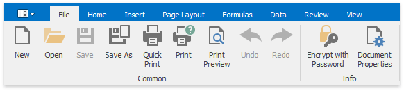
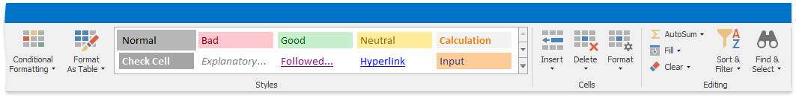
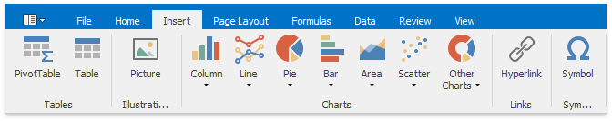
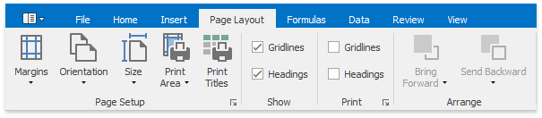
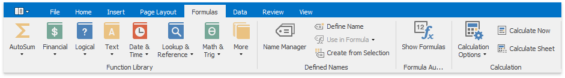
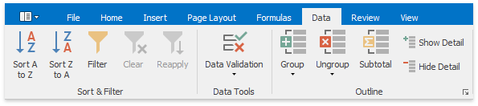
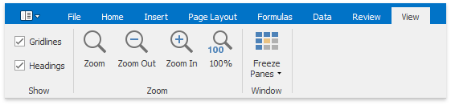
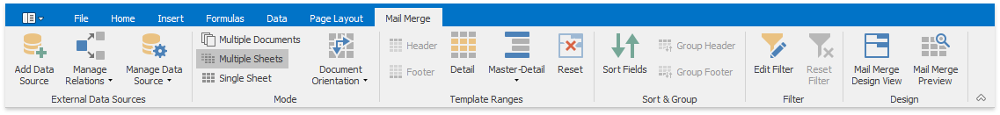

# Ribbon Interface
The comprehensive functionality of the **Spreadsheet** is provided by a set of **Ribbon** pages. Ribbon pages are divided into logical groups that include commands with common features. Use the **Ribbon** interface to perform basic operations in the **Spreadsheet** ([load](../file-operations/load-a-workbook.md), [create](../file-operations/create-a-workbook.md) and [save](../file-operations/save-a-workbook.md) workbooks, [add](../file-operations/create-a-worksheet.md) or [remove](../file-operations/delete-a-worksheet.md) worksheets, [format cells](../cell-formatting/format-cells.md), [insert rows](../columns-and-rows/insert-and-delete-columns-and-rows.md) and [columns](../columns-and-rows/insert-and-delete-columns-and-rows.md), etc.).

## File Tab

* [Create a Workbook](../file-operations/create-a-workbook.md)
* [Load a Workbook](../file-operations/load-a-workbook.md)
* [Save a Workbook](../file-operations/save-a-workbook.md)
* [Print a Workbook](../file-operations/print-a-workbook.md)
* [Undo and Redo Last Actions](../file-operations/undo-and-redo-last-actions.md)
* [Encrypt a Workbook with the Password](../protection/encrypt-a-workbook-with-the-password.md)

## Home Tab

* [Copy and Paste Cell Content](../editing-cells/copy-and-paste-cell-content.md)
* [Format Cells](../cell-formatting/format-cells.md)
* [Format Cell Content](../cell-formatting/format-cell-content.md)
* [Wrap Text and Merge Cells](../cell-formatting/wrap-text-and-merge-cells.md)
* [Number Formatting](../cell-formatting/number-formatting.md)
* [Conditional Formatting ](../cell-formatting/conditional-formatting.md)
* [Clear Cell Formatting](../cell-formatting/clear-cell-formatting.md)
* [Insert and Delete Columns and Rows](../columns-and-rows/insert-and-delete-columns-and-rows.md)
* [Show and Hide Columns and Rows](../columns-and-rows/show-and-hide-columns-and-rows.md)
* [Specify Column Width and Row Height](../columns-and-rows/specify-column-width-and-row-height.md)
* [Fill Data Automatically](../editing-cells/fill-data-automatically.md)
* [Find and Replace](../editing-cells/find-and-replace.md)

## Insert Tab

* [Create a Pivot Table](../pivot-tables/create-a-pivot-table.md)
* [Create a Table ](../tables/create-a-table.md)
* [Insert a Picture](../pictures-and-hyperlinks/insert-a-picture.md)
* [Move, Rotate and Resize a Picture](../pictures-and-hyperlinks/move-rotate-and-resize-a-picture.md)
* [Insert and Delete Hyperlinks](../pictures-and-hyperlinks/insert-and-delete-hyperlinks.md)
* [Charting Overview](../charting/charting-overview.md)
* [Creating a Chart](../charting/creating-a-chart.md)
* [Changing a Chart Type](../charting/changing-a-chart-type.md)
* [Applying a Predefined Chart Layout and Style](../charting/applying-a-predefined-chart-layout-and-style.md)
* [Modifying a Chart Manually](../charting/modifying-a-chart-manually.md)
* [Insert a Symbol](../editing-cells/insert-a-symbol.md)

## Page Layout Tab

* [Adjust Page Settings](../file-operations/adjust-page-settings.md)

## Formulas Tab

* [Create a Simple Formula](../formulas/create-a-simple-formula.md)
* [Cell References](../formulas/cell-references.md)
* [Defined Names](../formulas/defined-names.md)
* [Using Functions in Formulas ](../formulas/using-functions-in-formulas.md)
* [Supported Functions](../formulas/supported-functions.md)
* [Create an Array Formula ](../formulas/create-an-array-formula.md)
* [Error Types in Formulas](../formulas/error-types-in-formulas.md)

## Data Tab

* [Sort Data](../data-presentation/sort-data.md)
* [Filter Data](../data-presentation/filter-data.md)
* [Validate Data in Cells](../data-validation/validate-data-in-cells.md)
* [Outline Data](../data-presentation/outline-data.md)
* [Subtotal Data](../data-presentation/subtotal-data.md)

## Review Tab

* [Insert a Comment](../editing-cells/insert-a-comment.md)
* [Protect a Workbook](../protection/protect-a-workbook.md)
* [Protect a Worksheet](../protection/protect-a-worksheet.md)
* [Protect Worksheet Ranges](../protection/protect-worksheet-ranges.md)

## View Tab

* [Zoom a Worksheet](../viewing-and-navigating/zoom-a-worksheet.md)
* [Hide Gridlines and Headings](../viewing-and-navigating/hide-gridlines-and-headings.md)
* [Freeze Columns and Rows](../viewing-and-navigating/freeze-columns-and-rows.md)

## Mail Merge Tab

* [Mail Merge Overview](../mail-merge/mail-merge-overview.md)
* [Data Source Wizard](../mail-merge/data-source-wizard.md)
* [Query Builder](../mail-merge/query-builder.md)
* [Parameters Panel](../mail-merge/parameters-panel.md)