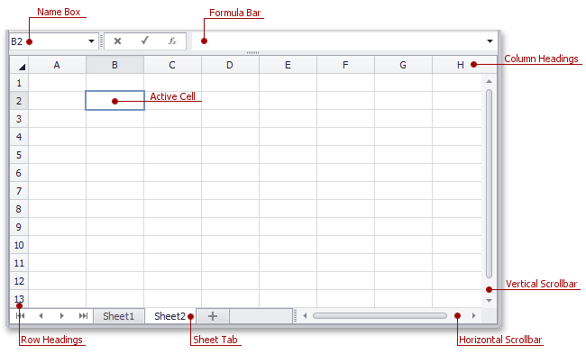
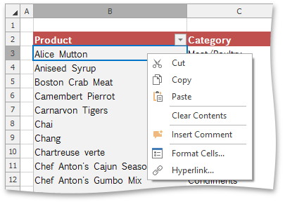

# Spreadsheet Elements
The **Spreadsheet** consists of visual elements that provide the capability to [create](../file-operations/create-a-workbook.md), edit and view spreadsheet documents, which are called **workbooks**. A workbook includes one or more **worksheets** used to store data. You can [add](../file-operations/create-a-worksheet.md), [delete](../file-operations/delete-a-worksheet.md) and [rename](../file-operations/rename-a-worksheet.md) worksheets in a workbook. All existing worksheets are displayed on the **Sheet tab** bar at the bottom of the control. Click one of the sheet tabs to switch between existing worksheets. To navigate through the current worksheet, use the horizontal and vertical **scrollbars**.

A worksheet consists of **cells** that are organized into 1,048,576 **rows** and 16,384 **columns**. Each row is numbered (**1**, **2**, **3**, ...) and each column is lettered (**A**, **B**, **C**, ...) if the [A1 reference style](../formulas/cell-references.md) is used, or numbered (**1**, **2**, **3**, ...) if the [R1C1 reference style](../formulas/cell-references.md) is specified. **Row** and **column headings** are displayed at the left and at the top of a worksheet, respectively.

An individual cell is a box at the intersection of a column and a row. Each cell is indicated by a **cell reference**, (the column letter and row number where the column and row intersect). For example, **B2** refers to a cell at the intersection of column **B** and row **2**. The cell reference is displayed in the **Name Box**, located at the top-left corner of a worksheet. The current cell that is selected and used to enter data is called the **active cell**. The active cell is identified by a blue border around the cell.

Each cell contains a single piece of data, the **cell value**. You can enter different types of values such as text, numbers or dates. The **Spreadsheet** also provides the capability to create and edit [formulas](../formulas/create-a-simple-formula.md) that perform calculations on the data on a worksheet. To enter a formula, you can use the **Formula Bar** at the top of a worksheet. If a cell does not contain a formula, the cell content is displayed in the **Formula Bar**.

## Context Menu
The **Spreadsheet** supports a **Context Menu**, which appears when you right-click anywhere on a worksheet (e.g., an individual cell, or row and column headers). The context menu provides common commands for working with a document.

