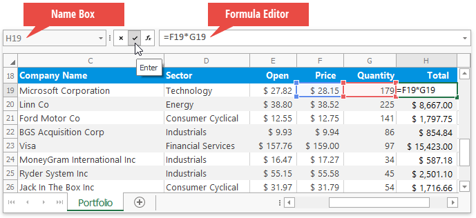
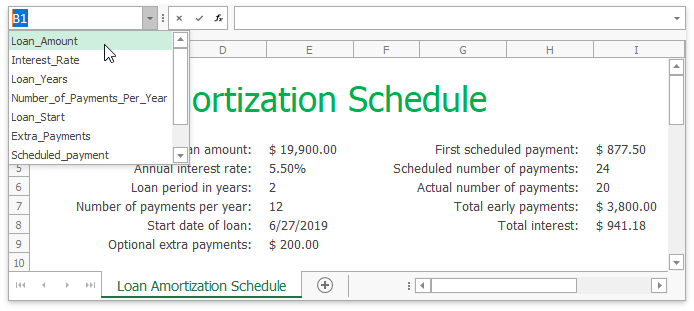
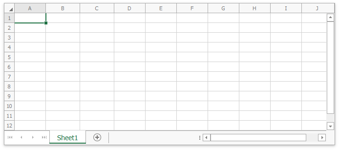
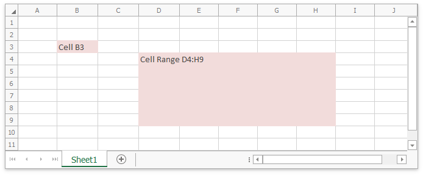

# Spreadsheet Elements

The **Spreadsheet** can include the following elements:

* [Ribbon](#ribbon)

* [Formula Bar](#formula-bar)

* [Spreadsheet Control](#spreadsheet-control)

* [Status Bar](#status-bar)

## Ribbon

A ribbon contains multiple tabs with grouped commands that enable you to perform basic operations in the Spreadsheet control: create, load, modify, save, and print spreadsheet documents.

## Formula Bar

The **Formula Bar** displays an active cell's value and allows you to view, enter, and edit formulas and cell data in the Spreadsheet control.

The **Name Box** is a part of the Formula Bar that displays a reference to an active cell or a name for the selected cell range (if specified), picture or chart. The Name Box also enables you to create named ranges, and quickly navigate to cells by their references and names.

## Spreadsheet Control

### Worksheet

A worksheet is a single page within a document. A worksheet is represented by a grid of cells and is used to store and edit data in the Spreadsheet control. The default Spreadsheet application contains one blank worksheet.

### Rows and Columns

Each worksheet is divided into 1,048,576 rows and 16,384 columns. Each row is numbered (1, 2, 3, ...) and each column is lettered (A, B, C, ...) or numbered (1, 2, 3, ...), depending on the reference style applied.

### Cells

All worksheet data is stored in cells. All cells have faint borders, or _gridlines_, around them.

You can double-click a cell, press **F2** or start typing to edit a cell value. You can enter a numeric] or text value, or insert a formula to calculate a cell's value dynamically.

### Selection

The Spreadsheet control enables you to select cells, cell ranges, rows, and columns in a worksheet. The selected cell used to enter data is called an _active cell_. When a cell range is selected, the active cell is usually the top left cell of this range.

### Sheet Tab Selector

The **Sheet Tab Selector** displays all worksheets in a workbook. It enables you to add new worksheets, move between the existing worksheets, rename, hide or delete them.

### Vertical and Horizontal Scroll Bars

The horizontal and vertical scroll bars allow you to navigate through the current worksheet.

### Context Menus

When you right-clicks anywhere on a worksheet (that is, a cell, row or column header, picture or chart), a context menu appears. It contains basic commands used to work with the current object.

## Status Bar

A status bar appears at the bottom of the Spreadsheet application and displays the following elements:

* Summary data: the average, count, numerical count, min, max, and sum of selected cells.

* The zoom level and zoom slider.

