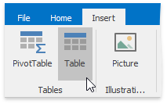
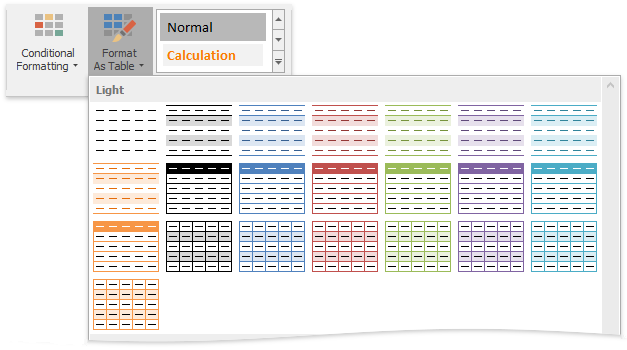
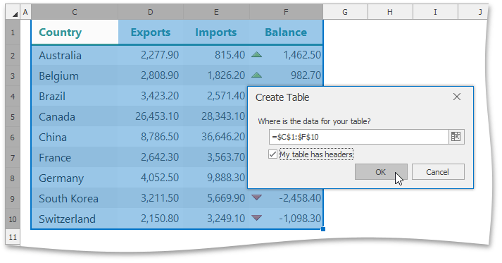
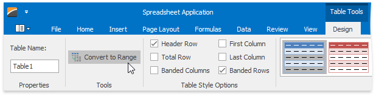

# Create a Table
The **Spreadsheet** allows you to insert a new table in a worksheet, or convert an existing range to a table.
* [Create a Table](#create)
* [Convert a Table to a Data Range](#convert)
* [Delete a Table](#delete)

## <a name="create"/>Create a Table
To insert a table, select the cell range to be included in the table.

Then, do one of the following.
* To create a table with the default style, on the **Insert** tab, in the **Tables** group, click the **Insert Table** button.
	
	
* To create a table with one of the predefined styles, on the **Home** tab, in the **Styles** group, click the **Format As Table** button and select the desired style from the gallery.
	
	

In the invoked **Create Table** dialog, verify that the range in the **Where is the data for your table?** field reflects your selection, and then specify whether or not the table has headers.

Note that after you create a table, the **Table Tools** contextual tab becomes available. Use this tab to provide some extra settings for the created table.

## <a name="convert"/>Convert a Table to a Data Range
To convert an existing table to a normal range of cells, do the following.
* Click the table to display the **Table Tools** contextual tab.
* On the **Design** tab, in the **Tools** group, click the **Convert To Range** button.
	
	

Note that after you delete a table, the table formatting persists. However, the **Table Tools** contextual tab is no longer available, and table features are lost. For example, you cannot use structured references (references that use table names) in formulas.

## <a name="delete"/>Delete a Table
To delete an existing table, select it and do one of the following.
* On the **Home** tab, in the **Editing** group, click **Clear** | **Clear All**.
	
	
* Press **DELETE**.