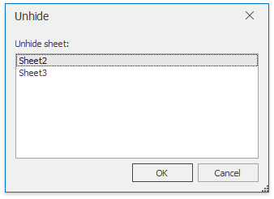

# Hide and Display Worksheets
The **Spreadsheet** provides the capability to hide worksheets in a workbook. It can be useful if you want to remove a worksheet from the **Sheet tab** bar without deleting it. By default, all worksheets are displayed on the **Sheet tab** bar.

## Hide Worksheets
1. Switch to a worksheet you want to hide. To hide multiple worksheets, hold down **CTRL** and then click the sheet tabs of the worksheets you wish to hide on the **Sheet tab** bar.
2. Do one of the following:
	* On the **Home** tab, in the **Cells** group, click the **Format** button and select **Hide &amp; Unhide | Hide Sheet**. Note that this command is disabled when a workbook includes only one worksheet.
		
		
	* Right-click the selected sheet tabs and select the **Hide** item from the context menu.

## Display Hidden Worksheets
1. Do one of the following:
	* On the **Home** tab, in the **Cells** group, click the **Format** button and select **Hide &amp; Unhide | Unhide Sheet...**;
		
		
	* Right-click any visible sheet tab, and select the **Unhide** item from the context menu.
2. In the **Unhide** dialog box that is invoked, select the name of the worksheet you want to display and click **OK**. Note that you can hide multiple worksheets at once, but you can display only one worksheet at a time.
	
	