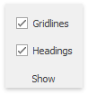

# Hide Gridlines and Headings
The **Spreadsheet** allows you to hide gridlines and headings that are displayed on a worksheet by default.

In the **Show** group within the **View** tab, uncheck the **Gridlines** check box to hide gridlines on a worksheet.

To hide the column and row headers, uncheck the **Headings** check box.

To display gridlines and headers, select the **Gridlines** and **Headings** check boxes, respectively.